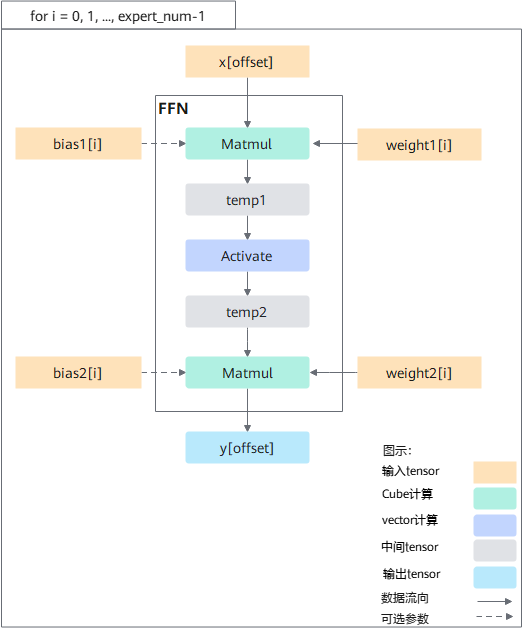

声明：本文使用[Creative Commons License version 4.0](https://creativecommons.org/licenses/by/4.0/legalcode)许可协议，转载、引用或修改等操作请遵循此许可协议。

# FFN

## 支持的产品型号

Atlas A2 训练系列产品/Atlas 800I A2 推理产品/A200I A2 Box 异构组件

产品形态详细说明请参见[昇腾产品形态说明](https://www.hiascend.com/document/redirect/CannCommunityProductForm)。

## 功能说明

- 算子功能：该FFN算子提供MoeFFN和FFN的计算功能。在没有专家分组（expertTokens为空）时是FFN，有专家分组时是MoeFFN，统称为FFN，属于Moe结构。MoE（Mixture-of-Experts，混合专家系统）是一种用于训练万亿参数量级模型的技术。MoE将预测建模任务分解为若干子任务，在每个子任务上训练一个专家模型（Expert Model），开发一个门控模型（Gating Model），该模型会根据输入数据分配一个或多个专家，最终综合多个专家计算结果作为预测结果。Mixture-of-Experts结构的模型是将输入数据分配给最相关的一个或者多个专家，综合涉及的所有专家的计算结果来确定最终结果。
- 计算公式：

  - **非量化场景：**

    $$
    y=activation(x * W1 + b1) * W2 + b2
    $$
  - **量化场景：**

    $$
    y=((activation((x * W1 + b1) * deqScale1) * scale + offset) * W2 + b2) * deqScale2
    $$
  - **伪量化场景：**

    $$
    y=activation(x * ((W1 + antiquantOffset1) * antiquantScale1) + b1) * ((W2 + antiquantOffset2) * antiquantScale2) + b2
    $$

  **说明：**
  FFN在无专家或单个专家场景是否有性能收益需要根据实际测试情况判断，当整网中FFN结构对应的小算子vector耗时超过30us，且在FFN结构中占比10%以上时，可以尝试使用该融合算子，若实际测试性能劣化则不使用。

## 实现原理

图1 FFN float16推理计算流程图



FFN主要由两个matmul和一个激活函数组成，按遍历专家的方式进行计算，计算过程分为3步：

1. temp1 = Matmul(x[offset], weight1[i]) + bias1[i]，执行第i个专家的第一个matmul，该计算在Cube上进行，计算结果保存在临时内存中；其中bias1为可选参数；offset在循环开始初始化为0，循环末尾更新为offset=offset+tokens[i]，再进入下一轮循环，tokens[i]为分配给第i个专家的token数量；x[offset]表示分配给第i个专家的token在输入x中的起始位置；
2. temp2 = Activate(temp1)，执行第i个专家的激活函数，该计算在Vector上进行，计算结果保存在临时内存中，其中Activate激活函数类型参考activation参数说明；
3. y[offset] = Matmul(temp2, weight2[i]) + bias2[i]，执行第i个专家的第二个matmul，该计算在Cube上进行，计算结果保存在该融合算子分配的输出内存中；其中bias2为可选参数；其中y[offset]表示根据分配给第i个专家的token在输出y中的起始位置；

如下代码示例给出小算子和FFN融合算子的对应关系：

```python
# 小算子
offset = 0
for i in range(expert_num):
    Matmul(x[offset], weight1[i], bias1[i])
    temp2 = Activate(temp1)  # Activate根据实际需要调用对应的激活函数
    y[offset] = Matmul(temp2, weight2[i]) + bias2[i]
    offset += tokens[i]
# 融合算子
y = FFN(x, weight1, weight2, tokens, bias1, bias2, activateType)  # 具体参数顺序参考接口原型
```

## 算子执行接口

每个算子分为[两段式接口](common/两段式接口.md)，必须先调用“aclnnFFNGetWorkspaceSize”接口获取计算所需workspace大小以及包含了算子计算流程的执行器，再调用“aclnnFFN”接口执行计算。

* `aclnnStatus aclnnFFNGetWorkspaceSize(const aclTensor* x, const aclTensor* weight1, const aclTensor* weight2, const aclIntArray* expertTokens, const aclTensor* bias1, const aclTensor* bias2, const aclTensor* scale, const aclTensor* offset, const aclTensor* deqScale1, const aclTensor* deqScale2, const aclTensor* antiquantScale1, const aclTensor* antiquantScale2, const aclTensor* antiquantOffset1, const aclTensor* antiquantOffset2, const char* activation, int64_t innerPrecise, const aclTensor* y, uint64_t* workspaceSize, aclOpExecutor** executor)`
* `aclnnStatus aclnnFFN(void* workspace, uint64_t workspaceSize, aclOpExecutor* executor, aclrtStream stream)`

**说明**：

- 算子执行接口对外屏蔽了算子内部实现逻辑以及不同代际NPU的差异，且开发者无需编译算子，实现了算子的精简调用。
- 若开发者不使用算子执行接口的调用算子，也可以定义基于Ascend IR的算子描述文件，通过ATC工具编译获得算子om文件，然后加载模型文件执行算子，详细调用方法可参见《应用开发指南》的[单算子调用 > 单算子模型执行](https://hiascend.com/document/redirect/CannCommunityCppOpcall)章节。

### aclnnFFNGetWorkspaceSize

- **参数说明：**

  - x（aclTensor\*，计算输入）：必选参数，Device侧的aclTensor，公式中的输入x，数据类型支持FLOAT16、BFLOAT16、INT8，[数据格式](common/数据格式.md)支持ND，支持输入的维度最少是2维[M, K1]，最多是8维。
  - weight1（aclTensor\*，计算输入）：必选参数，Device侧的aclTensor，专家的权重数据，公式中的W1，数据类型支持FLOAT16、BFLOAT16、INT8、INT4，[数据格式](common/数据格式.md)支持ND，输入在有/无专家时分别为[E, K1, N1]/[K1, N1]。
  - weight2（aclTensor\*，计算输入）：必选参数，Device侧的aclTensor，专家的权重数据，公式中的W2，数据类型支持FLOAT16、BFLOAT16、INT8、INT4，[数据格式](common/数据格式.md)支持ND，输入在有/无专家时分别为[E, K2, N2]/[K2, N2]。

    **说明：**
    M表示token个数，对应transform中的BS（B：Batch，表示输入样本批量大小，S：Seq-Length，表示输入样本序列长度）；K1表示第一个matmul的输入通道数，对应transform中的H（Head-Size，表示隐藏层的大小）；N1表示第一个matmul的输出通道数；K2表示第二个matmul的输入通道数；N2表示第二个matmul的输出通道数，对应transform中的H；E表示有专家场景的专家数。
  - expertTokens（aclIntArray\*，计算输入）：可选参数，Host侧的aclIntArray类型，代表各专家的token数，数据类型支持INT64，[数据格式](common/数据格式.md)支持ND，若不为空时可支持的最大长度为256个。
  - bias1（aclTensor\*，计算输入）：可选参数，Device侧的aclTensor，权重数据修正值，公式中的b1，数据类型支持FLOAT16、FLOAT32、INT32，[数据格式](common/数据格式.md)支持ND，输入在有/无专家时分别为[E, N1]/[N1]。
  - bias2（aclTensor\*，计算输入）：可选参数，Device侧的aclTensor，权重数据修正值，公式中的b2，数据类型支持FLOAT16、FLOAT32、INT32，[数据格式](common/数据格式.md)支持ND，输入在有/无专家时分别为[E, N2]/[N2]。
  - scale（aclTensor\*，计算输入）：可选参数，Device侧的aclTensor，量化参数，量化缩放系数，数据类型支持FLOAT32，[数据格式](common/数据格式.md)支持ND，per-tensor下输入在有/无专家时均为一维向量，输入元素个数在有/无专家时分别为[E]/[1]；per-channel下输入在有/无专家时为二维向量/一维向量，输入元素个数在有/无专家时分别为[E, N1]/[N1]。
  - offset（aclTensor\*，计算输入）：可选参数，Device侧的aclTensor，量化参数，量化偏移量，数据类型支持FLOAT32，[数据格式](common/数据格式.md)支持ND，一维向量，输入元素个数在有/无专家时分别为[E]/[1]。
  - deqScale1（aclTensor\*，计算输入）：可选参数，Device侧的aclTensor，量化参数，第一个matmul的反量化缩放系数，数据类型支持UINT64、INT64、FLOAT32、BFLOAT16，[数据格式](common/数据格式.md)支持ND，输入在有/无专家时分别为[E, N1]/[N1]。
  - deqScale2（aclTensor\*，计算输入）：可选参数，Device侧的aclTensor，量化参数，第二个matmul的反量化缩放系数，数据类型支持UINT64、INT64、FLOAT32、BFLOAT16，[数据格式](common/数据格式.md)支持ND，输入在有/无专家时分别为[E, N2]/[N2]。
  - antiquantScale1（aclTensor\*，计算输入）：可选参数，Device侧的aclTensor，伪量化参数，第一个matmul的缩放系数，数据类型支持FLOAT16、BFLOAT16，[数据格式](common/数据格式.md)支持ND，per-channel下输入在有/无专家时分别为[E, N1]/[N1]，per-in-group下输入在有/无专家时分别为[E, G, N1]/[G, N1]。
  - antiquantScale2（aclTensor\*，计算输入）：可选参数，Device侧的aclTensor，伪量化参数，第二个matmul的缩放系数，数据类型支持FLOAT16、BFLOAT16，[数据格式](common/数据格式.md)支持ND，per-channel下输入在有/无专家时分别为[E, N2]/[N2]，per-in-group下输入在有/无专家时分别为[E, G, N2]/[G, N2]。
  - antiquantOffset1（aclTensor\*，计算输入）：可选参数，Device侧的aclTensor，伪量化参数，第一个matmul的偏移量，数据类型支持FLOAT16、BFLOAT16，[数据格式](common/数据格式.md)支持ND，per-channel下输入在有/无专家时分别为[E, N1]/[N1]，per-in-group下输入在有/无专家时分别为[E, G, N1]/[G, N1]。
  - antiquantOffset2（aclTensor\*，计算输入）：可选参数，Device侧的aclTensor，伪量化参数，第二个matmul的偏移量，数据类型支持FLOAT16、BFLOAT16，[数据格式](common/数据格式.md)支持ND，per-channel下输入在有/无专家时分别为[E, N2]/[N2]，per-in-group下输入在有/无专家时分别为[E, G, N2]/[G, N2]。

    **说明：**
    G表示伪量化per-in-group场景下，antiquantOffset、antiquantScale的组数。
  - activation（char\*，计算输入）：必选参数，Host侧的属性值，代表使用的激活函数，公式中的activation，当前支持fastgelu/gelu/relu/silu以及geglu/swiglu/reglu。
  - innerPrecise（int64\_t，计算输入）：可选参数，Host侧的int，表示高精度或者高性能选择。数据类型支持INT64。该参数仅对FLOAT16生效，BFLOAT16和INT8不区分高精度和高性能。

    - innerPrecise为0时，代表开启高精度模式，算子内部采用FLOAT32数据类型计算。
    - innerPrecise为1时，代表高性能模式。
  - y（aclTensor\*，计算输出）：Device侧的aclTensor，公式中的输出y，数据类型支持FLOAT16、BFLOAT16，[数据格式](common/数据格式.md)支持ND，输出维度与x一致。
  - workspaceSize（uint64\_t\*，出参）：返回用户需要在Device侧申请的workspace大小。
  - executor（aclOpExecutor\*\*，出参）：返回op执行器，包含了算子计算流程。
- **返回值：**

  返回aclnnStatus状态码，具体参见[aclnn返回码](common/aclnn返回码.md)。

  ```
  第一段接口完成入参校验，若出现以下错误码，则对应原因为：
  - 返回161001（ACLNN_ERR_PARAM_NULLPTR）：如果传入参数是必选输入，输出或者必选属性，且是空指针，则返回161001。
  - 返回161002（ACLNN_ERR_PARAM_INVALID）：x、weight1、weight2、activation、expertTokens、bias1、bias2、y的数据类型和数据格式不在支持的范围内。
  ```

### aclnnFFN

- **参数说明：**

  - workspace（void\*，入参）：在Device侧申请的workspace内存起址。
  - workspaceSize（uint64\_t，入参）：在Device侧申请的workspace大小，由第一段接口aclnnFFNGetWorkspaceSize获取。
  - executor（aclOpExecutor\*，入参）：op执行器，包含了算子计算流程。
  - stream（aclrtStream，入参）：指定执行任务的AscendCL stream流。
- **返回值：**

  返回aclnnStatus状态码，具体参见[aclnn返回码](common/aclnn返回码.md)。

## 约束说明

- 有专家时，专家数据的总数需要与x的M保持一致。
- 激活层为geglu/swiglu/reglu时，仅支持无专家分组时的FLOAT16高性能场景（FLOAT16场景指类型为aclTensor的必选参数数据类型都为FLOAT16的场景），且N1=2\*K2。
- 激活层为gelu/fastgelu/relu/silu时，支持有专家或无专家分组的FLOAT16高精度及高性能场景、BFLOAT16场景、量化场景及伪量化场景，且N1=K2。
- 所有场景下需满足K1=N2, K1<65536, K2<65536, M轴在32Byte对齐后小于INT32的最大值。
- 非量化场景不能输入量化参数和伪量化参数，量化场景不能输入伪量化参数，伪量化场景不能输入量化参数。
- 量化场景参数类型：x为INT8、weight为INT8、bias为INT32、scale为FLOAT32、offset为FLOAT32，其余参数类型根据y不同分两种情况：
  - y为FLOAT16，deqScale支持数据类型：UINT64、INT64、FLOAT32。
  - y为BFLOAT16，deqScale支持数据类型：BFLOAT16。
  - 要求deqScale1与deqScale2的数据类型保持一致。
- 量化场景支持scale的per-channel模式参数类型：x为INT8、weight为INT8、bias为INT32、scale为FLOAT32、offset为FLOAT32，其余参数类型根据y不同分两种情况：
  - y为FLOAT16，deqScale支持数据类型：UINT64、INT64。
  - y为BFLOAT16，deqScale支持数据类型：BFLOAT16。
  - 要求deqScale1与deqScale2的数据类型保持一致。
- 伪量化场景支持两种不同参数类型：
  - y为FLOAT16、x为FLOAT16、bias为FLOAT16，antiquantScale为FLOAT16、antiquantOffset为FLOAT16，weight支持数据类型INT8和INT4。
  - y为BFLOAT16、x为BFLOAT16、bias为FLOAT32，antiquantScale为BFLOAT16、antiquantOffset为BFLOAT16，weight支持数据类型INT8和INT4。
- 当weight1/weight2的数据类型为INT4时，其shape最后一维必须为偶数。
- 伪量化场景，per-in-group下，antiquantScale1和antiquantOffset1中的K1需要能整除组数G，antiquantScale2和antiquantOffset2中的K2需要能整除组数G。
- 伪量化场景，per-in-group下目前只支持weight是INT4数据类型的场景。
- innerPrecise参数在BFLOAT16非量化场景，只能配置为0；FLOAT16非量化场景，可以配置为0或者1；量化或者伪量化场景，0和1都可配置，但是配置后不生效。

## 算子原型

```c++
REG_OP(FFN)
    .INPUT(x, TensorType({DT_INT8, DT_FLOAT16, DT_BF16}))
    .INPUT(weight1, TensorType({DT_INT8, DT_FLOAT16, DT_BF16, DT_INT4}))
    .INPUT(weight2, TensorType({DT_INT8, DT_FLOAT16, DT_BF16, DT_INT4}))
    .OPTIONAL_INPUT(expert_tokens, TensorType({DT_INT64}))
    .OPTIONAL_INPUT(bias1, TensorType({DT_INT32, DT_FLOAT16, DT_FLOAT}))
    .OPTIONAL_INPUT(bias2, TensorType({DT_INT32, DT_FLOAT16, DT_FLOAT}))
    .OPTIONAL_INPUT(scale, TensorType({DT_FLOAT}))
    .OPTIONAL_INPUT(offset, TensorType({DT_FLOAT}))
    .OPTIONAL_INPUT(deq_scale1, TensorType({DT_UINT64, DT_BF16, DT_INT64, DT_FLOAT}))
    .OPTIONAL_INPUT(deq_scale2, TensorType({DT_UINT64, DT_BF16, DT_INT64, DT_FLOAT}))
    .OPTIONAL_INPUT(antiquant_scale1, TensorType({DT_FLOAT16, DT_BF16}))
    .OPTIONAL_INPUT(antiquant_scale2, TensorType({DT_FLOAT16, DT_BF16}))
    .OPTIONAL_INPUT(antiquant_offset1, TensorType({DT_FLOAT16, DT_BF16}))
    .OPTIONAL_INPUT(antiquant_offset2, TensorType({DT_FLOAT16, DT_BF16}))
    .OUTPUT(y, TensorType({DT_FLOAT16, DT_BF16}))
    .REQUIRED_ATTR(activation, String)
    .ATTR(inner_precise, Int, 0)
    .ATTR(output_dtype, Int, -1)
    .ATTR(tokens_index_flag, Bool, false)
    .OP_END_FACTORY_REG(FFN)
```

参数解释请参见**算子执行接口**。

## 调用示例

该融合算子接口有两种调用方式：

- PyTorch框架调用

  如果通过PyTorch单算子方式调用该融合算子，则需要参考PyTorch融合算子[torch_npu.npu_ffn](https://hiascend.com/document/redirect/PyTorchAPI)；如果用户定制了该融合算子，则需要参考《Ascend C算子开发》手册[适配PyTorch框架](https://hiascend.com/document/redirect/CannCommunityAscendCInvorkOnNetwork)。
- aclnn单算子调用方式

  通过aclnn单算子调用示例代码如下，仅供参考，具体编译和执行过程请参考[编译与运行样例](common/编译与运行样例.md)。

  ```c++
  #include <iostream>
  #include <vector>
  #include "acl/acl.h"
  #include "aclnnop/aclnn_ffn.h"

  #define CHECK_RET(cond, return_expr) \
    do {                               \
      if (!(cond)) {                   \
        return_expr;                   \
      }                                \
    } while (0)

  #define LOG_PRINT(message, ...)     \
    do {                              \
      printf(message, ##__VA_ARGS__); \
    } while (0)

  int64_t GetShapeSize(const std::vector<int64_t>& shape) {
    int64_t shapeSize = 1;
    for (auto i : shape) {
      shapeSize *= i;
    }
    return shapeSize;
  }

  int Init(int32_t deviceId, aclrtStream* stream) {
    // 固定写法，AscendCL初始化
    auto ret = aclInit(nullptr);
    CHECK_RET(ret == ACL_SUCCESS, LOG_PRINT("aclInit failed. ERROR: %d\n", ret); return ret);
    ret = aclrtSetDevice(deviceId);
    CHECK_RET(ret == ACL_SUCCESS, LOG_PRINT("aclrtSetDevice failed. ERROR: %d\n", ret); return ret);
    ret = aclrtCreateStream(stream);
    CHECK_RET(ret == ACL_SUCCESS, LOG_PRINT("aclrtCreateStream failed. ERROR: %d\n", ret); return ret);
    return 0;
  }

  template <typename T>
  int CreateAclTensor(const std::vector<T>& hostData, const std::vector<int64_t>& shape, void** deviceAddr,
                      aclDataType dataType, aclTensor** tensor) {
    auto size = GetShapeSize(shape) * sizeof(T);
    // 调用aclrtMalloc申请device侧内存
    auto ret = aclrtMalloc(deviceAddr, size, ACL_MEM_MALLOC_HUGE_FIRST);
    CHECK_RET(ret == ACL_SUCCESS, LOG_PRINT("aclrtMalloc failed. ERROR: %d\n", ret); return ret);

    // 调用aclrtMemcpy将host侧数据拷贝到device侧内存上
    ret = aclrtMemcpy(*deviceAddr, size, hostData.data(), size, ACL_MEMCPY_HOST_TO_DEVICE);
    CHECK_RET(ret == ACL_SUCCESS, LOG_PRINT("aclrtMemcpy failed. ERROR: %d\n", ret); return ret);

    // 计算连续tensor的strides
    std::vector<int64_t> strides(shape.size(), 1);
    for (int64_t i = shape.size() - 2; i >= 0; i--) {
      strides[i] = shape[i + 1] * strides[i + 1];
    }

    // 调用aclCreateTensor接口创建aclTensor
    *tensor = aclCreateTensor(shape.data(), shape.size(), dataType, strides.data(), 0, aclFormat::ACL_FORMAT_ND,
                              shape.data(), shape.size(), *deviceAddr);
    return 0;
  }

  int main() {
    // 1. （固定写法）device/stream初始化，参考AscendCL对外接口列表
    // 根据自己的实际device填写deviceId
    int32_t deviceId = 0;
    aclrtStream stream;
    auto ret = Init(deviceId, &stream);
    // check根据自己的需要处理
    CHECK_RET(ret == ACL_SUCCESS, LOG_PRINT("Init acl failed. ERROR: %d\n", ret); return ret);

    // 2. 构造输入与输出，需要根据API的接口自定义构造
    std::vector<int64_t> selfShape = {4, 2};
    std::vector<int64_t> outShape = {4, 2};
    std::vector<int64_t> weight1Shape = {2, 2};
    std::vector<int64_t> weight2Shape = {2, 2};
    void* selfDeviceAddr = nullptr;
    void* outDeviceAddr = nullptr;
    void* weight1DeviceAddr = nullptr;
    void* weight2DeviceAddr = nullptr;
    aclTensor* self = nullptr;
    aclTensor* out = nullptr;
    aclTensor* weight1 = nullptr;
    aclTensor* weight2 = nullptr;
    std::vector<float> selfHostData = {0.1, 0.2, 0.3, 0.4, 0.5, 0.6, 0.7, 0.8};
    std::vector<float> outHostData = {0, 0, 0, 0};
    std::vector<float> weight1HostData = {0.1, 0.2, 0.3, 0.4};
    std::vector<float> weight2HostData = {0.4, 0.3, 0.2, 0.1};
    // 创建self aclTensor
    ret = CreateAclTensor(selfHostData, selfShape, &selfDeviceAddr, aclDataType::ACL_FLOAT16, &self);
    CHECK_RET(ret == ACL_SUCCESS, return ret);
    // 创建out aclTensor
    ret = CreateAclTensor(outHostData, outShape, &outDeviceAddr, aclDataType::ACL_FLOAT16, &out);
    CHECK_RET(ret == ACL_SUCCESS, return ret);
    // 创建weight1 aclTensor
    ret = CreateAclTensor(weight1HostData, weight1Shape, &weight1DeviceAddr, aclDataType::ACL_FLOAT16, &weight1);
    CHECK_RET(ret == ACL_SUCCESS, return ret);
    // 创建weight2 aclTensor
    ret = CreateAclTensor(weight2HostData, weight2Shape, &weight2DeviceAddr, aclDataType::ACL_FLOAT16, &weight2);
    CHECK_RET(ret == ACL_SUCCESS, return ret);

    uint64_t workspaceSize = 0;
    aclOpExecutor* executor;

    // aclnnFFN接口调用示例
    LOG_PRINT("test aclnnFFN\n");

    // 3. 调用CANN算子库API，需要修改为具体的Api名称
    // 调用aclnnFFN第一段接口
    ret = aclnnFFNGetWorkspaceSize(self, weight1, weight2, NULL, NULL, NULL, NULL, NULL, NULL, NULL, NULL, NULL, NULL, NULL,   "relu", 1, out, &workspaceSize, &executor);
    CHECK_RET(ret == ACL_SUCCESS, LOG_PRINT("aclnnFFNGetWorkspaceSize failed. ERROR: %d\n", ret); return ret);
    // 根据第一段接口计算出的workspaceSize申请device内存
    void* workspaceAddr = nullptr;
    if (workspaceSize > 0) {
      ret = aclrtMalloc(&workspaceAddr, workspaceSize, ACL_MEM_MALLOC_HUGE_FIRST);
      CHECK_RET(ret == ACL_SUCCESS, LOG_PRINT("allocate workspace failed. ERROR: %d\n", ret); return ret);
    }
    // 调用aclnnFFN第二段接口
    ret = aclnnFFN(workspaceAddr, workspaceSize, executor, stream);
    CHECK_RET(ret == ACL_SUCCESS, LOG_PRINT("aclnnFFN failed. ERROR: %d\n", ret); return ret);

    // 4. （固定写法）同步等待任务执行结束
    ret = aclrtSynchronizeStream(stream);
    CHECK_RET(ret == ACL_SUCCESS, LOG_PRINT("aclrtSynchronizeStream failed. ERROR: %d\n", ret); return ret);

    // 5. 获取输出的值，将device侧内存上的结果拷贝至host侧，需要根据具体API的接口定义修改
    auto size = GetShapeSize(outShape);
    std::vector<float> resultData(size, 0);
    ret = aclrtMemcpy(resultData.data(), resultData.size() * sizeof(resultData[0]), outDeviceAddr,
                      size * sizeof(resultData[0]), ACL_MEMCPY_DEVICE_TO_HOST);
    CHECK_RET(ret == ACL_SUCCESS, LOG_PRINT("copy result from device to host failed. ERROR: %d\n", ret); return ret);
    for (int64_t i = 0; i < size; i++) {
      LOG_PRINT("result[%ld] is: %f\n", i, resultData[i]);
    }

    // 6. 释放aclTensor，需要根据具体API的接口定义修改
    aclDestroyTensor(self);
    aclDestroyTensor(out);
    aclDestroyTensor(weight1);
    aclDestroyTensor(weight2);

    // 7. 释放device资源
    aclrtFree(selfDeviceAddr);
    aclrtFree(outDeviceAddr);
    aclrtFree(weight1DeviceAddr);
    aclrtFree(weight2DeviceAddr);
    if (workspaceSize > 0) {
      aclrtFree(workspaceAddr);
    }
    aclrtDestroyStream(stream);
    aclrtResetDevice(deviceId);
    aclFinalize();

    return 0;
  }
  ```
