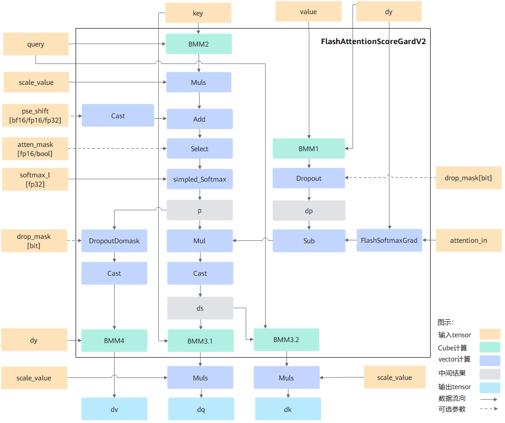

声明：本文使用[Creative Commons License version 4.0](https://creativecommons.org/licenses/by/4.0/legalcode)许可协议，转载、引用或修改等操作请遵循此许可协议。

# FlashAttentionScoreGradV2


## 支持的产品型号
Atlas A2 训练系列产品

产品形态详细说明请参见[昇腾产品形态说明](https://www.hiascend.com/document/redirect/CannCommunityProductForm)。

## 功能说明

- 算子功能：训练场景下计算注意力的反向输出，即[FlashAttentionScoreV2](./FlashAttentionScoreV2.md)的反向计算。**该接口相较于[FlashAttentionScoreGrad](./FlashAttentionScoreGrad.md)接口，新增psetype参数**：

  - psetype=1时，与[FlashAttentionScoreGrad](./FlashAttentionScoreGrad.md)实现相同。
  - psetype=其他取值时，需要先mul再add。

- 计算公式：

  已知注意力的正向计算公式为（psetype=1时，与[FlashAttentionScoreGrad](./FlashAttentionScoreGrad.md)计算公式相同，psetype=其他取值公式如下）：

  $$
  Y=Dropout(Softmax(Mask(\frac{QK^T}{\sqrt{d}}+pse),atten\_mask),keep\_prob)V
  $$

  为方便表达，以变量$S$和$P$表示计算公式：

  $$
  S=Mask(\frac{QK^T}{\sqrt{d}}+pse),atten\_mask
  $$

  $$
  P=Dropout(Softmax(S),keep\_prob)
  $$

  $$
  Y=PV
  $$

  则注意力的反向计算公式为：

  $$
  dV=P^TdY
  $$

  $$
  dQ=\frac{((dS)*K)}{\sqrt{d}}
  $$

  $$
  dK=\frac{((dS)^T*Q)}{\sqrt{d}}
  $$


## 实现原理

图1 计算流程图
 

按照flashAttention反向计算流程实现，整体计算流程如下：
1. 重计算p，$p = SimpledSoftmax(Mask(Matmul(query, key^T) * scale+pse))$，本步骤重计算了fa流程中的softmax结果p，计算结果保存的ub中。
2. 计算dp，$dp = Dropout(Matmul(dy, value^T))$，该计算包含matmul计算和dropout计算，matmul计算中，左矩阵为dy，右矩阵为转置后的value。
3. 计算ds，$ds = p * Sub(dp, FlashSoftmaxGrad(dy, attention\_in))$，本计算中，FlashSoftmaxGrad计算的入参为dy、正向输出attention\_in，该结果与dp做减操作，最终的结果与p相乘得到结果ds。
4. 计算dq，$dq = Matmul(ds, key) * scale$，本计算将ds结果与key做matmul做计算，并将结果与scale相乘得到结果dq。
5. 计算dk，$dk = Matmul(ds^T, query) * scale$，本计算将转置后的ds结果与query做matmul计算，并将结果与scale相乘得到结果dk。
6. 计算dv，$dv = Matmul(DropOut(p)^T, dy)$；本计算p的结果做drop计算，转置后与dy做matmul计算。

## 算子执行接口

每个算子分为两段式接口，必须先调用“aclnnFlashAttentionScoreGradV2GetWorkspaceSize”接口获取计算所需workspace大小以及包含了算子计算流程的执行器，再调用“aclnnFlashAttentionScoreGradV2”接口执行计算。

* `aclnnStatus aclnnFlashAttentionScoreGradV2GetWorkspaceSize(const aclTensor *query, const aclTensor *keyIn, const aclTensor *value, const aclTensor *dy, const aclTensor *pseShiftOptional, const aclTensor *dropMaskOptional, const aclTensor *paddingMaskOptional, const aclTensor *attenMaskOptional, const aclTensor *softmaxMaxOptional, const aclTensor *softmaxSumOptional, const aclTensor *softmaxInOptional, const aclTensor *attentionInOptional, const aclIntArray *prefixOptional, const aclIntArray *qStartIdxOptional, const aclIntArray *kvStartIdxOptional, double scaleValueOptional, double keepProbOptional, int64_t preTokensOptional, int64_t nextTokensOptional, int64_t headNum, char *inputLayout, int64_t innerPreciseOptional, int64_t sparseModeOptional, int64_t pseTypeOptional, const aclTensor *dqOut, const aclTensor *dkOut, const aclTensor *dvOut, const aclTensor *dpseOut, uint64_t *workspaceSize, aclOpExecutor **executor)`
* `aclnnStatus aclnnFlashAttentionScoreGradV2(void *workspace, uint64_t workspaceSize, aclOpExecutor *executor, aclrtStream stream)`

**说明**：

  - 算子执行接口对外屏蔽了算子内部实现逻辑以及不同代际NPU的差异，且开发者无需编译算子，实现了算子的精简调用。
  - 若开发者不使用算子执行接口的调用算子，也可以定义基于Ascend IR的算子描述文件，通过ATC工具编译获得算子om文件，然后加载模型文件执行算子，详细调用方法可参见《应用开发指南》的[单算子调用 > 单算子模型执行](https://hiascend.com/document/redirect/CannCommunityCppOpcall)章节。

### aclnnFlashAttentionScoreGradV2GetWorkspaceSize

- **参数说明：**
  - query（aclTensor\*，计算输入）：Device侧的aclTensor，公式中的输入Q，数据类型支持FLOAT16、BFLOAT16、FLOAT32，[数据格式](common/数据格式.md)支持ND，综合约束请见[约束说明](#1)。

  - keyIn（aclTensor\*，计算输入）：Device侧的aclTensor，公式中的输入K，数据类型支持FLOAT16、BFLOAT16、FLOAT32，[数据格式](common/数据格式.md)支持ND，综合约束请见[约束说明](#1)。

  - value（aclTensor\*，计算输入）：Device侧的aclTensor，公式中的输入V，数据类型支持FLOAT16、BFLOAT16、FLOAT32，[数据格式](common/数据格式.md)支持ND，综合约束请见[约束说明](#1)。

  - dy（aclTensor\*，计算输入）：Device侧的aclTensor，公式中的输入dY，数据类型支持FLOAT16、BFLOAT16、FLOAT32，[数据格式](common/数据格式.md)支持ND，综合约束请见[约束说明](#1)。

  - pseShiftOptional（aclTensor\*，计算输入）：Device侧的aclTensor，公式中的输入pse，可选参数，表示位置编码，数据类型支持FLOAT16、BFLOAT16、FLOAT32，[数据格式](common/数据格式.md)支持ND，支持shape范围为\[B,N,S,S\]、\[B,N,1,S\]、\[1,N,S,S\]、\[B,N,H,S\]、\[1,N,H,S\]，H固定为1024。alibi位置编码场景，preTokens和nextTokens必须配置下三角。后续章节如无特殊说明，S表示query或key、value的sequence length, Sq表示query的sequence length, Skv表示key、value的sequence length, SS表示Sq*Skv。如果psetype为2或3的时候，数据类型需为FLOAT32, 对应shape支持范围是\[B,N],\[N]。

  - dropMaskOptional（aclTensor\*，计算输入）：Device侧的aclTensor，可选属性，数据类型支持UINT8，[数据格式](common/数据格式.md)支持ND，其shape和数据排布可表示为：

    $$
     (\sum_{b=0}^{B-1} (\sum_{n=0}^{N-1}(Sq*Skv)))/8
    $$

  - paddingMaskOptional（aclTensor\*，计算输入）：Device侧的aclTensor，**预留参数暂未使用**。

  - qStartIdxOptional（aclIntArray\*，计算输入）：Host侧的aclIntArray。可选参数。数据类型支持INT64，代表外切场景，当前分块的Q的sequence在全局中的起始索引，默认值为0，[数据格式](common/数据格式.md)支持ND。

  - kvStartIdxOptional（aclIntArray\*，计算输入）：Host侧的aclIntArray，可选参数，数据类型支持INT64，代表外切场景，当前分块的Q的sequence在全局中的起始索引，默认值为0，[数据格式](common/数据格式.md)支持ND。

  - attenMaskOptional（aclTensor\*，计算输入）：Device侧的aclTensor，可选属性，0代表保留，1代表掩掉的mask矩阵，数据类型支持BOOL\(8bit的BOOL\)、UINT8，[数据格式](common/数据格式.md)支持ND，支持shape范围为\[B,N,S,S\]、\[B,1,S,S\]、\[1,1,S,S\]、\[S,S\]；综合约束请见[约束说明](#1)。

  - softmaxMaxOptional（aclTensor\*，计算输入）：Device侧的aclTensor，注意力正向计算的中间输出，数据类型支持FLOAT，[数据格式](common/数据格式.md)支持ND。综合约束请见[约束说明](#1)。

  - softmaxSumOptional（aclTensor\*，计算输入）：Device侧的aclTensor，注意力正向计算的中间输出，数据类型支持FLOAT，[数据格式](common/数据格式.md)支持ND；综合约束请见[约束说明](#1)。

  - softmaxInOptional（aclTensor\*，计算输入）：Device侧的aclTensor，注意力正向计算的中间输出，**预留参数暂未使用，调用时该参数需传空**。

  - attentionInOptional（aclTensor\*，计算输入）：Device侧的aclTensor，注意力正向计算的最终输出，数据类型支持FLOAT16、BFLOAT16、FLOAT32，数据类型和shape与query一致，[数据格式](common/数据格式.md)支持ND。

  - prefixOptional（aclTensor\*，计算输入）：Device侧的aclTensor，可选属性，代表prefix稀疏计算场景每个Batch的N值，数据类型支持INT64，[数据格式](common/数据格式.md)支持ND；综合约束请见[约束说明](#1)。

  - dqOut（aclTensor\*，计算输出）：Device侧的aclTensor，公式中的dQ，表示query的梯度，计算输出，数据类型支持FLOAT16、BFLOAT16、FLOAT32，[数据格式](common/数据格式.md)支持ND。

  - dkOut（aclTensor\*，计算输出）：Device侧的aclTensor，公式中的dK，表示keyIn的梯度，计算输出，数据类型支持FLOAT16、BFLOAT16、FLOAT32，[数据格式](common/数据格式.md)支持ND。

  - dvOut（aclTensor\*，计算输出）：Device侧的aclTensor，公式中的dV，表示value的梯度，计算输出，数据类型支持FLOAT16、BFLOAT16、FLOAT32，[数据格式](common/数据格式.md)支持ND。

  - dpseOut（aclTensor\*，计算输出）：Device侧的aclTensor，公式中的d\(pse\)，表示pse的梯度，计算输出，数据类型支持FLOAT16、BFLOAT16、FLOAT32，[数据格式](common/数据格式.md)支持ND，**预留参数暂未使用**，但在pseShiftOptional不为空时，shape和数据类型与pseShiftOptional一致。

  - scaleValueOptional（double，计算输入）：Host侧的double，公式中d开根号的倒数，代表缩放系数，作为计算流中Muls的scalar值，数据类型支持DOUBLE。

  - keepProbOptional（double，计算输入）：Host侧的double，可选参数，代表dropMaskOptional中1的比例，数据类型支持DOUBLE；综合约束请见[约束说明](#1)。

  - preTokensOptional（int64\_t，计算输入）：Host侧的int64\_t，用于稀疏计算的参数，可选参数，数据类型支持INT64。

  - nextTokensOptional（int64\_t，计算输入）：Host侧的int64\_t，用于稀疏计算的参数，可选参数，数据类型支持INT64。

  - headNum（int64\_t，计算输入）：Host侧的int64\_t，代表head个数，数据类型支持INT64；综合约束请见[约束说明](#1)。

  - inputLayout（string\*，计算输入）：Host侧的string，代表输入query、keyIn、value的数据排布格式，支持BSH、SBH、BSND、BNSD。

      **说明：**
      query、keyIn、value数据排布格式支持从多种维度解读，其中B（Batch）表示输入样本批量大小、S（Seq-Length）表示输入样本序列长度、H（Head-Size）表示隐藏层的大小、N（Head-Num）表示多头数、D（Head-Dim）表示隐藏层最小的单元尺寸，且满足D=H/N。

  - innerPreciseOptional（int64\_t，计算输入）：**保留参数，暂未使用**。

  - sparseModeOptional（int64\_t，计算输入）：Host侧的int，表示sparse的模式。数据类型支持INT64。

    -   sparseModeOptional为0时，代表defaultMask模式，如果attenMaskOptional未传入则不做mask操作，忽略preTokensOptional和nextTokensOptional\(内部赋值为INT\_MAX\)；如果传入，则需要传入完整的attenMaskOptional矩阵（S1 \* S2），表示preTokensOptional和nextTokensOptional之间的部分需要计算。
    -   sparseModeOptional为1时，代表allMask，即传入完整的attenMaskOptional矩阵。
    -   sparseModeOptional为2时，代表leftUpCausal模式的mask，对应以左顶点为划分的下三角场景，需要传入优化后的attenMaskOptional矩阵（2048\*2048）。
    -   sparseModeOptional为3时，代表rightDownCausal模式的mask，对应以右下顶点为划分的下三角场景，需要传入优化后的attenMaskOptional矩阵（2048\*2048）。
    -   sparseModeOptional为4时，代表band场景，即计算preTokensOptional和nextTokensOptional之间的部分。
    -   sparseModeOptional为5时，代表prefix场景，即在rightDownCasual的基础上，左侧加上一个长为S1，宽为N的矩阵，N的值由输入prefixOptional获取，每个Batch对应一个PrefixN值。该场景下，attenMask的shape类型不支持\[1,1,S,S\]、\[S,S\]。
    -   sparseModeOptional为6时，代表prefix压缩场景，需要传入shape为\[3072, 2048\]的attenMaskOptional矩阵；分为两部分：其中上半部分为\[2048, 2048\]的下三角矩阵；下半部分为\[1024, 2048\]的矩阵，矩形矩阵左半部分全0，右半部分全1。0代表保留，1代表掩掉。

    用户不特意指定时可传入默认值0。sparse不同模式的详细说明请参见[sparse模式说明](./common/sparse_mode参数说明.md)。

    **说明：**
    当所有的attenMaskOptional的shape小于2048且相同的时候，建议使用default模式，来减少内存使用量；sparseModeOptional配置为1、2、3、5、6时，用户配置的preTokensOptional、nextTokensOptional不会生效；sparseModeOptional配置为0、4时，须保证attenMaskOptional与preTokensOptional、nextTokensOptional的范围一致。

  - pseTypeOptional （int64\_t，计算输入）：Host侧的int64_t。数据类型支持：INT64。可选参数，用户不特意指定时可传入1，跟当前[FlashAttentionScoreGrad](./FlashAttentionScoreGrad.md)实现一致，支持配置值为0、1、2、3。
    | pseType     | 含义                              |      备注   |
    | ----------- | --------------------------------- | ----------|
    | 0           | 外部传入pse 先mul再add              | - |
    | 1           | 外部传入pse 先add再mul              | 跟[FlashAttentionScoreGrad](./FlashAttentionScoreGrad.md)实现一致 |
    | 2           | 内部生成pse 先mul再add              | - |
    | 3           | 内部生成pse 先mul再add再sqrt         | - |

  - workspaceSize（uint64\_t\*，出参）：返回用户需要在Device侧申请的workspace大小。

  - executor（aclOpExecutor\*\*，出参）：返回op执行器，包含了算子计算流程。

- **返回值：**

  返回aclnnStatus状态码，具体参见[aclnn返回码](common/aclnn返回码.md)。

  ```
  第一段接口完成入参校验，若出现以下错误码，则对应原因为：
  - 返回161001（ACLNN_ERR_PARAM_NULLPTR）：如果传入参数是必选输入，输出或者必选属性，且是空指针，则返回161001。
  - 返回161002（ACLNN_ERR_PARAM_INVALID）：query、keyIn、value、dy、pseShiftOptional、dropMaskOptional、paddingMaskOptional、attenMaskOptional、softmaxMaxOptional、softmaxSumOptional、softmaxInOptional、attentionInOptional、dqOut、dkOut、dvOut的数据类型和数据格式不在支持的范围内。
  ```

### aclnnFlashAttentionScoreGradV2

-   **参数说明：**
    -   workspace（void\*，入参）：在Device侧申请的workspace内存起址。
    -   workspaceSize（uint64\_t，入参）：在Device侧申请的workspace大小，由第一段接口aclnnFlashAttentionScoreGradV2GetWorkspaceSize获取。
    -   executor（aclOpExecutor\*，入参）：op执行器，包含了算子计算流程。
    -   stream（aclrtStream，入参）：指定执行任务的AscendCL stream流。

-   **返回值：**

    返回aclnnStatus状态码，具体参见[aclnn返回码](common/aclnn返回码.md)。

## 约束说明<a name="1"></a>

- 该接口与pytorch配合使用时，需要保证CANN相关包与PyTorch相关包的版本匹配。
- 输入query、key、value、dy的B：batchsize必须相等。
- 输入query、key、value、dy的input_layout必须一致。
- 输入key/value的shape必须一致，在query/key/value的d大小相同的情况下，query/dy的shape必须一致。注：当前版本仅支持query/key/value的d大小相同的情况。
- 支持输入query/dy的N和key/value的N不相等，但必须成比例关系，即Nq/Nkv必须是非0整数，Nq取值范围1~256。
- 关于数据shape的约束，以inputLayout的BSND、BNSD为例（BSH、SBH下H=N\*D），其中：

    -   B：取值范围为1\~2M。带prefixOptional的时候B最大支持2K。
    -   N：取值范围为1\~256。
    -   S：取值范围为1\~1M。
    -   D：取值范围为1\~512。
    -   KeepProb: 取值范围为(0, 1].
- 部分场景下，如果计算量过大可能会导致算子执行超时(aicore error类型报错，errorStr为：timeout or trap error)，此时建议做轴切分处理，注：这里的计算量会受B、S、N、D等参数的影响，值越大计算量越大。
- 关于softmaxMax与softmaxSum参数的约束：输入格式固定为\[B, N, S, 8\],TND的输入格式除外，此时为\[T, N, 8\],注：T=B*S。
- headNum的取值必须和传入的Query中的N值保持一致。
- band场景，preTokensOptional和nextTokensOptional之间必须要有交集。
- prefixOptional稀疏计算场景即sparseModeOptional=5或者sparseModeOptional=6，当Sq > Skv时，prefix的N值取值范围\[0, Skv\]，当Sq <= Skv时，prefix的N值取值范围\[Skv-Sq, Skv\]。
- pseShiftOptional Sq大于1024时如果配置BNHS、1NHS，需要Sq和Skv等长。

## 算子原型

```c++
REG_OP(FlashAttentionScore)
    .INPUT(query, TensorType({DT_FLOAT16, DT_BF16, DT_FLOAT32}))
    .INPUT(key, TensorType({DT_FLOAT16, DT_BF16, DT_FLOAT32}))
    .INPUT(value, TensorType({DT_FLOAT16, DT_BF16, DT_FLOAT32}))
    .OPTIONAL_INPUT(real_shift, TensorType({DT_FLOAT16, DT_BF16, DT_FLOAT32}))
    .OPTIONAL_INPUT(drop_mask, TensorType({DT_UINT8}))
    .OPTIONAL_INPUT(padding_mask, TensorType({DT_FLOAT16, DT_BF16, DT_FLOAT32}))
    .OPTIONAL_INPUT(atten_mask, TensorType({DT_BOOL, DT_UINT8}))
    .OPTIONAL_INPUT(prefix, TensorType({DT_INT64}))
    .OPTIONAL_INPUT(actual_seq_qlen, TensorType({DT_INT64}))
    .OPTIONAL_INPUT(actual_seq_kvlen, TensorType({DT_INT64}))
    .OPTIONAL_INPUT(q_start_idx, TensorType({DT_INT64}))
    .OPTIONAL_INPUT(kv_start_idx, TensorType({DT_INT64}))
    .OUTPUT(softmax_max, TensorType({DT_FLOAT32}))
    .OUTPUT(softmax_sum, TensorType({DT_FLOAT32}))
    .OUTPUT(softmax_out, TensorType({DT_FLOAT16, DT_BF16, DT_FLOAT32}))
    .OUTPUT(attention_out, TensorType({DT_FLOAT16, DT_BF16, DT_FLOAT32}))
    .ATTR(scale_value, Float, 1.0)
    .ATTR(keep_prob, Float, 1.0)
    .ATTR(pre_tockens, Int, 2147483647)
    .ATTR(next_tockens, Int, 2147483647)
    .REQUIRED_ATTR(head_num, Int)
    .REQUIRED_ATTR(input_layout, String)
    .ATTR(inner_precise, Int, 0)
    .ATTR(sparse_mode, Int, 0)
    .ATTR(pse_type, Int, 1)
    .OP_END_FACTORY_REG(FlashAttentionScore)
```

参数解释请参见**算子执行接口**。

## 调用示例

该融合算子有两种调用方式：通过PyTorch框架在网络模型中调用，通过aclnn单算子进行调用：

- PyTorch框架调用

  如果通过PyTorch单算子方式调用该融合算子，并且用户定制了该融合算子，则需要参考《Ascend C算子开发》手册[适配PyTorch框架](https://hiascend.com/document/redirect/CannCommunityAscendCInvorkOnNetwork)。

- aclnn单算子调用方式

  通过aclnn单算子调用示例代码如下，仅供参考，具体编译和执行过程请参考[编译与运行样例](common/编译与运行样例.md)。

  ```C++
  #include <iostream>
  #include <vector>
  #include "acl/acl.h"
  #include "aclnnop/aclnn_flash_attention_score_grad.h"

  #define CHECK_RET(cond, return_expr) \
    do {                               \
      if (!(cond)) {                   \
        return_expr;                   \
      }                                \
    } while (0)

  #define LOG_PRINT(message, ...)     \
    do {                              \
      printf(message, ##__VA_ARGS__); \
    } while (0)

  int64_t GetShapeSize(const std::vector<int64_t>& shape) {
    int64_t shapeSize = 1;
    for (auto i : shape) {
      shapeSize *= i;
    }
    return shapeSize;
  }

  void PrintOutResult(std::vector<int64_t> &shape, void** deviceAddr) {
    auto size = GetShapeSize(shape);
    std::vector<float> resultData(size, 0);
    auto ret = aclrtMemcpy(resultData.data(), resultData.size() * sizeof(resultData[0]),
                           *deviceAddr, size * sizeof(resultData[0]), ACL_MEMCPY_DEVICE_TO_HOST);
    CHECK_RET(ret == ACL_SUCCESS, LOG_PRINT("copy result from device to host failed. ERROR: %d\n", ret); return);
    for (int64_t i = 0; i < size; i++) {
      LOG_PRINT("mean result[%ld] is: %f\n", i, resultData[i]);
    }
  }

  int Init(int32_t deviceId, aclrtStream* stream) {
    // 固定写法，AscendCL初始化
    auto ret = aclInit(nullptr);
    CHECK_RET(ret == ACL_SUCCESS, LOG_PRINT("aclInit failed. ERROR: %d\n", ret); return ret);
    ret = aclrtSetDevice(deviceId);
    CHECK_RET(ret == ACL_SUCCESS, LOG_PRINT("aclrtSetDevice failed. ERROR: %d\n", ret); return ret);
    ret = aclrtCreateStream(stream);
    CHECK_RET(ret == ACL_SUCCESS, LOG_PRINT("aclrtCreateStream failed. ERROR: %d\n", ret); return ret);
    return 0;
  }

  template <typename T>
  int CreateAclTensor(const std::vector<T>& hostData, const std::vector<int64_t>& shape, void** deviceAddr,
                      aclDataType dataType, aclTensor** tensor) {
    auto size = GetShapeSize(shape) * sizeof(T);
    // 调用aclrtMalloc申请device侧内存
    auto ret = aclrtMalloc(deviceAddr, size, ACL_MEM_MALLOC_HUGE_FIRST);
    CHECK_RET(ret == ACL_SUCCESS, LOG_PRINT("aclrtMalloc failed. ERROR: %d\n", ret); return ret);
    // 调用aclrtMemcpy将host侧数据拷贝到device侧内存上
    ret = aclrtMemcpy(*deviceAddr, size, hostData.data(), size, ACL_MEMCPY_HOST_TO_DEVICE);
    CHECK_RET(ret == ACL_SUCCESS, LOG_PRINT("aclrtMemcpy failed. ERROR: %d\n", ret); return ret);

    // 计算连续tensor的strides
    std::vector<int64_t> strides(shape.size(), 1);
    for (int64_t i = shape.size() - 2; i >= 0; i--) {
      strides[i] = shape[i + 1] * strides[i + 1];
    }

    // 调用aclCreateTensor接口创建aclTensor
    *tensor = aclCreateTensor(shape.data(), shape.size(), dataType, strides.data(), 0, aclFormat::ACL_FORMAT_ND,
                              shape.data(), shape.size(), *deviceAddr);
    return 0;
  }

  int main() {
    // 1. （固定写法）device/stream初始化，参考AscendCL对外接口列表
    // 根据自己的实际device填写deviceId
    int32_t deviceId = 0;
    aclrtStream stream;
    auto ret = Init(deviceId, &stream);
    CHECK_RET(ret == ACL_SUCCESS, LOG_PRINT("Init acl failed. ERROR: %d\n", ret); return ret);

    // 2. 构造输入与输出，需要根据API的接口自定义构造
    std::vector<int64_t> qShape = {256, 1, 128};
    std::vector<int64_t> kShape = {256, 1, 128};
    std::vector<int64_t> vShape = {256, 1, 128};
    std::vector<int64_t> dxShape = {256, 1, 128};
    std::vector<int64_t> attenmaskShape = {256, 256};
    std::vector<int64_t> softmaxMaxShape = {1, 1, 256, 8};
    std::vector<int64_t> softmaxSumShape = {1, 1, 256, 8};
    std::vector<int64_t> attentionInShape = {256, 1, 128};

    std::vector<int64_t> dqShape = {256, 1, 128};
    std::vector<int64_t> dkShape = {256, 1, 128};
    std::vector<int64_t> dvShape = {256, 1, 128};

    void* qDeviceAddr = nullptr;
    void* kDeviceAddr = nullptr;
    void* vDeviceAddr = nullptr;
    void* dxDeviceAddr = nullptr;
    void* attenmaskDeviceAddr = nullptr;
    void* softmaxMaxDeviceAddr = nullptr;
    void* softmaxSumDeviceAddr = nullptr;
    void* attentionInDeviceAddr = nullptr;
    void* dqDeviceAddr = nullptr;
    void* dkDeviceAddr = nullptr;
    void* dvDeviceAddr = nullptr;

    aclTensor* q = nullptr;
    aclTensor* k = nullptr;
    aclTensor* v = nullptr;
    aclTensor* dx = nullptr;
    aclTensor* pse = nullptr;
    aclTensor* dropMask = nullptr;
    aclTensor* padding = nullptr;
    aclTensor* attenmask = nullptr;
    aclTensor* softmaxMax = nullptr;
    aclTensor* softmaxSum = nullptr;
    aclTensor* softmaxIn = nullptr;
    aclTensor* attentionIn = nullptr;
    aclTensor* dq = nullptr;
    aclTensor* dk = nullptr;
    aclTensor* dv = nullptr;
    aclTensor* dpse = nullptr;

    std::vector<short> qHostData(32768, 1);
    std::vector<short> kHostData(32768, 1);
    std::vector<short> vHostData(32768, 1);
    std::vector<short> dxHostData(32768, 1);
    std::vector<uint8_t> attenmaskHostData(65536, 0);
    std::vector<float> softmaxMaxHostData(2048, 3.0);
    std::vector<float> softmaxSumHostData(2048, 3.0);
    std::vector<short> attentionInHostData(32768, 1);
    std::vector<short> dqHostData(32768, 0);
    std::vector<short> dkHostData(32768, 0);
    std::vector<short> dvHostData(32768, 0);

    ret = CreateAclTensor(qHostData, qShape, &qDeviceAddr, aclDataType::ACL_FLOAT16, &q);
    CHECK_RET(ret == ACL_SUCCESS, return ret);
    ret = CreateAclTensor(kHostData, kShape, &kDeviceAddr, aclDataType::ACL_FLOAT16, &k);
    CHECK_RET(ret == ACL_SUCCESS, return ret);
    ret = CreateAclTensor(vHostData, vShape, &vDeviceAddr, aclDataType::ACL_FLOAT16, &v);
    CHECK_RET(ret == ACL_SUCCESS, return ret);
    ret = CreateAclTensor(dxHostData, dxShape, &dxDeviceAddr, aclDataType::ACL_FLOAT16, &dx);
    CHECK_RET(ret == ACL_SUCCESS, return ret);
    ret = CreateAclTensor(attenmaskHostData, attenmaskShape, &attenmaskDeviceAddr, aclDataType::ACL_UINT8, &attenmask);
    CHECK_RET(ret == ACL_SUCCESS, return ret);
    ret = CreateAclTensor(softmaxMaxHostData, softmaxMaxShape, &softmaxMaxDeviceAddr, aclDataType::ACL_FLOAT, &softmaxMax);
    CHECK_RET(ret == ACL_SUCCESS, return ret);
    ret = CreateAclTensor(softmaxSumHostData, softmaxSumShape, &softmaxSumDeviceAddr, aclDataType::ACL_FLOAT, &softmaxSum);
    CHECK_RET(ret == ACL_SUCCESS, return ret);
    ret = CreateAclTensor(attentionInHostData, attentionInShape, &attentionInDeviceAddr, aclDataType::ACL_FLOAT16, &attentionIn);
    CHECK_RET(ret == ACL_SUCCESS, return ret);
    ret = CreateAclTensor(dqHostData, dqShape, &dqDeviceAddr, aclDataType::ACL_FLOAT16, &dq);
    CHECK_RET(ret == ACL_SUCCESS, return ret);
    ret = CreateAclTensor(dkHostData, dkShape, &dkDeviceAddr, aclDataType::ACL_FLOAT16, &dk);
    CHECK_RET(ret == ACL_SUCCESS, return ret);
    ret = CreateAclTensor(dvHostData, dvShape, &dvDeviceAddr, aclDataType::ACL_FLOAT16, &dv);
    CHECK_RET(ret == ACL_SUCCESS, return ret);
    
    std::vector<int64_t> prefixOp = {0};
    aclIntArray *prefix = aclCreateIntArray(prefixOp.data(), 1);
    std::vector<int64_t> qStartIdxOp = {0};
    std::vector<int64_t> kvStartIdxOp = {0};
    aclIntArray *qStartIdx = aclCreateIntArray(qStartIdxOp.data(), 1);
    aclIntArray *kvStartIdx = aclCreateIntArray(kvStartIdxOp.data(), 1);
    double scaleValue = 0.088388;
    double keepProb = 1;
    int64_t preTokens = 65536;
    int64_t nextTokens = 65536;
    int64_t headNum = 1;
    int64_t innerPrecise = 0;
    int64_t sparseMod = 0;
    int64_t pseType = 1;
    char layOut[5] = {'S', 'B', 'H', 0};
    
    // 3. 调用CANN算子库API，需要修改为具体的Api名称
    uint64_t workspaceSize = 0;
    aclOpExecutor* executor;
    
    // 调用aclnnFlashAttentionScoreGrad第一段接口
    ret = aclnnFlashAttentionScoreGradV2GetWorkspaceSize(q, k, v, dx, pse, dropMask, padding,
              attenmask, softmaxMax, softmaxSum, softmaxIn, attentionIn, prefix, qStartIdx, kvStartIdx,
              scaleValue, keepProb, preTokens, nextTokens, headNum, layOut, innerPrecise, sparseMod, pseType,
              dq, dk, dv, dpse, &workspaceSize, &executor);
    CHECK_RET(ret == ACL_SUCCESS, LOG_PRINT("aclnnFlashAttentionScoreGradV2GetWorkspaceSize failed. ERROR: %d\n", ret); return ret);
    
    // 根据第一段接口计算出的workspaceSize申请device内存
    void* workspaceAddr = nullptr;
    if (workspaceSize > 0) {
      ret = aclrtMalloc(&workspaceAddr, workspaceSize, ACL_MEM_MALLOC_HUGE_FIRST);
      CHECK_RET(ret == ACL_SUCCESS, LOG_PRINT("allocate workspace failed. ERROR: %d\n", ret); return ret);
    }
    
    // 调用aclnnFlashAttentionScoreGrad第二段接口
    ret = aclnnFlashAttentionScoreGradV2(workspaceAddr, workspaceSize, executor, stream);
    CHECK_RET(ret == ACL_SUCCESS, LOG_PRINT("aclnnFlashAttentionScoreGradV2 failed. ERROR: %d\n", ret); return ret);
    
    // 4. （固定写法）同步等待任务执行结束
    ret = aclrtSynchronizeStream(stream);
    CHECK_RET(ret == ACL_SUCCESS, LOG_PRINT("aclrtSynchronizeStream failed. ERROR: %d\n", ret); return ret);
    
    // 5. 获取输出的值，将device侧内存上的结果拷贝至host侧，需要根据具体API的接口定义修改
    PrintOutResult(dqShape, &dqDeviceAddr);
    PrintOutResult(dkShape, &dkDeviceAddr);
    PrintOutResult(dvShape, &dvDeviceAddr);
    
    // 6. 释放aclTensor和aclScalar，需要根据具体API的接口定义修改
    aclDestroyTensor(q);
    aclDestroyTensor(k);
    aclDestroyTensor(v);
    aclDestroyTensor(dx);
    aclDestroyTensor(attenmask);
    aclDestroyTensor(softmaxMax);
    aclDestroyTensor(softmaxSum);
    aclDestroyTensor(attentionIn);
    aclDestroyTensor(dq);
    aclDestroyTensor(dk);
    aclDestroyTensor(dv);
    
    // 7. 释放device资源
    aclrtFree(qDeviceAddr);
    aclrtFree(kDeviceAddr);
    aclrtFree(vDeviceAddr);
    aclrtFree(dxDeviceAddr);
    aclrtFree(attenmaskDeviceAddr);
    aclrtFree(softmaxMaxDeviceAddr);
    aclrtFree(softmaxSumDeviceAddr);
    aclrtFree(attentionInDeviceAddr);
    aclrtFree(dqDeviceAddr);
    aclrtFree(dkDeviceAddr);
    aclrtFree(dvDeviceAddr);
    if (workspaceSize > 0) {
      aclrtFree(workspaceAddr);
    }
    aclrtDestroyStream(stream);
    aclrtResetDevice(deviceId);
    aclFinalize();
    
    return 0;
  }

  ```