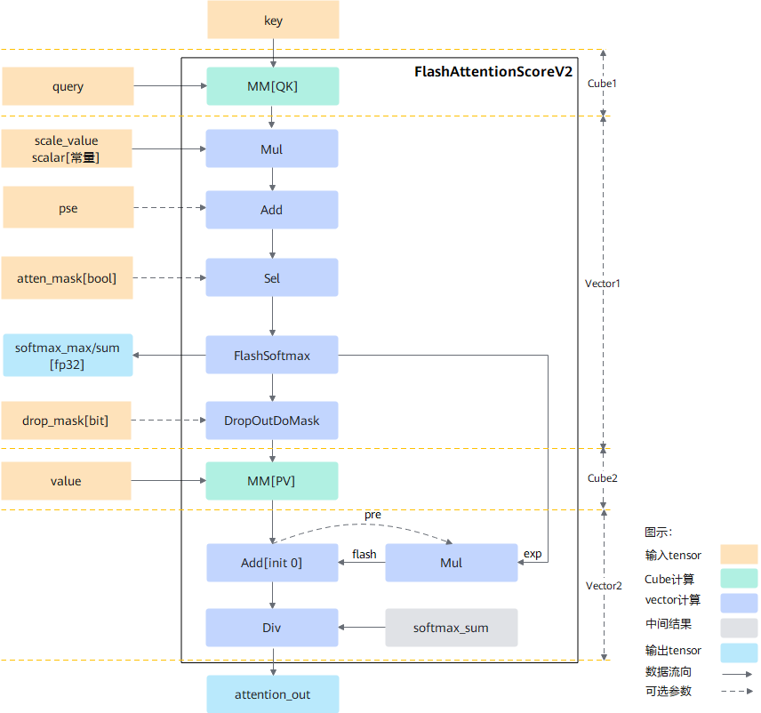

声明：本文使用[Creative Commons License version 4.0](https://creativecommons.org/licenses/by/4.0/legalcode)许可协议，转载、引用或修改等操作请遵循此许可协议。

# FlashAttentionScoreV2

## 支持的产品型号

Atlas A2 训练系列产品

产品形态详细说明请参见[昇腾产品形态说明](https://www.hiascend.com/document/redirect/CannCommunityProductForm)。

## 功能说明

- 算子功能：训练场景下，使用FlashAttention算法实现self-attention（自注意力）的计算。**该接口相较于[FlashAttentionScore](./FlashAttentionScore.md)接口，新增psetype参数**：

  -   psetype=1时，与[FlashAttentionScore](./FlashAttentionScore.md)实现相同。
  -   psetype=其他取值时，需要先mul再add。

- 计算公式：

   注意力的正向计算公式如下：

   - psetype=1时，与[FlashAttentionScore](./FlashAttentionScore.md)计算公式相同。

   - psetype=其他取值时，公式如下：
     $$
     attention\_out=Dropout(Softmax(Mask(scale*(query*key^T) + pse),atten\_mask),keep\_prob)*value
     $$


## 实现原理
图1 训练计算流程图



按照flashAttention正向计算流程实现，整体计算流程如下：

1. query与转置后的key做matmul计算后得到最初步的attention_score，然后乘以缩放系数scale_value后与位置编码pse相加。此时的结果通过atten_mask进行select操作，将atten_mask中为true的位置进行遮蔽，得到结果masked_attention_score，即atten_mask中为true的位置在select后结果为负的极小值，经过softmax计算之后变成0从而达到遮蔽效果。

2. 为了实现FlashAttention加速算法，使用FlashSoftmax操作对masked_attention_score进行运算，用以代替原公式中的softmax运算，而后将结果与value做matmul运算。由于FlashSoftmax操作对masked_attention_score的Skv(输入key、value的sequence length)方向进行了切分，故实现过程中存在一个刷新流程，具体如下：
    1. 每次FlashSoftmax计算只对切分后的一个SkvSplit（SkvSplit是针对Skv轴进行切分之后的序列长度的简称）进行操作，并从第二次循环开始记录exp，其中 i 表示Skv切分后的循环变量，针对exp的i是从1开始 ，exp的计算公式如下：
       $$
       exp[i] = e^{max_{i - 1} - max_{i}}
       $$
    2. 当i = 0时，计算出的MM[PV]结果直接保存到ub_attention_out[0]的ub中。
    3. 从i = 1开始，需要增加Mul和Add操作，即将上一次的MM[PV]的结果和当前exp相乘，相乘完的结果和本次MM[PV]的结果相加得到的结果保存到ub_attention_out[1]的ub中。以此类推，遍历Skv计算完成。
    4. 由于FlashSoftmax计算中的除sum被后移到输出attention_out之前，因此最后需要将ub中的ub_attention_out按行除以softmax_sum并将最终完整的结果保存到输出内存attention_out(Final)上。

## 算子执行接口

每个算子分为[两段式接口](common/两段式接口.md)，必须先调用“aclnnFlashAttentionScoreV2GetWorkspaceSize”接口获取计算所需workspace大小以及包含了算子计算流程的执行器，再调用“aclnnFlashAttentionScoreV2”接口执行计算。

* `aclnnStatus aclnnFlashAttentionScoreV2GetWorkspaceSize(const aclTensor *query,const aclTensor *key,const aclTensor *value,const aclTensor *realShiftOptional,const aclTensor *dropMaskOptional,const aclTensor *paddingMaskOptional,const aclTensor *attenMaskOptional,const aclIntArray *prefixOptional,const aclIntArray *qStartIdxOptional,const aclIntArray *kvStartIdxOptional,double scaleValueOptional,double keepProbOptional,int64_t preTokensOptional,int64_t nextTokensOptional,int64_t headNum,char *inputLayout,int64_t innerPreciseOptional,int64_t sparseModeOptional,int64_t pseTypeOptional,const aclTensor *softmaxMaxOut,const aclTensor *softmaxSumOut,const aclTensor *softmaxOutOut,const aclTensor *attentionOutOut,uint64_t *workspaceSize,aclOpExecutor **executor)`
* `aclnnStatus aclnnFlashAttentionScoreV2(void *workspace, uint64_t workspaceSize, aclOpExecutor *executor, const aclrtStream stream)`

**说明**：

- 算子执行接口对外屏蔽了算子内部实现逻辑以及不同代际NPU的差异，且开发者无需编译算子，实现了算子的精简调用。
- 若开发者不使用算子执行接口的调用算子，也可以定义基于Ascend IR的算子描述文件，通过ATC工具编译获得算子om文件，然后加载模型文件执行算子，详细调用方法可参见《应用开发指南》的[单算子调用 > 单算子模型执行](https://hiascend.com/document/redirect/CannCommunityCppOpcall)章节。


### aclnnFlashAttentionScoreV2GetWorkspaceSize

- **参数说明：**
  - query（aclTensor\*，计算输入）：Device侧的aclTensor，数据类型支持FLOAT16、BFLOAT16、FLOAT32。数据类型与key/value的数据类型一致，[数据格式](common/数据格式.md)支持ND；综合约束请见[约束说明](#1)。
  - key（aclTensor\*，计算输入）：Device侧的aclTensor，数据类型支持FLOAT16、BFLOAT16、FLOAT32，数据类型与query/value的数据类型一致，[数据格式](common/数据格式.md)支持ND；综合约束请见[约束说明](#1)。
  - value（aclTensor\*，计算输入）：Device侧的aclTensor，数据类型支持FLOAT16、BFLOAT16、FLOAT32，数据类型与query/key的数据类型一致，[数据格式](common/数据格式.md)支持ND；综合约束请见[约束说明](#1)。
  - realShiftOptional（aclTensor\*，计算输入）：Device侧的aclTensor，公式中的输入pse，可选参数。数据类型支持FLOAT16、BFLOAT16、FLOAT32，数据类型与query的数据类型一致。[数据格式](common/数据格式.md)支持ND，输入shape类型需为\[B,N,S,S\]、\[B,N,1,S\]、\[1,N,S,S\]。如果Sq大于1024、每个batch的Sq与Skv等长且是sparseModeOptional为0、2、3的下三角掩码场景，可使能alibi位置编码压缩，此时只需要输入原始PSE最后1024行进行内存优化，即alibi_compress = ori_pse\[:, :, -1024:, :\]，参数每个batch不相同时，输入BNHSkv(H=1024)，每个batch相同时，输入1NHSkv(H=1024)。后续章节如无特殊说明，S表示query或key、value的sequence length，Sq表示query的sequence length，Skv表示key、value的sequence length，SS表示Sq*Skv。如果psetype为2或3的时候，数据类型需为FLOAT32, 对应shape支持范围是\[B,N],\[N]

  - dropMaskOptional（aclTensor\*，计算输入）：Device侧的aclTensor，公式中的dropout，可选参数，数据类型支持UINT8（标识8个1bit BOOL），[数据格式](common/数据格式.md)支持ND。
  - paddingMaskOptional（aclTensor\*，计算输入）：**预留参数，暂未使用**。
  - attenMaskOptional（aclTensor\*，计算输入）：Device侧的aclTensor，公式中的atten_mask，可选参数，数据类型支持BOOL、UINT8，[数据格式](common/数据格式.md)支持ND，输入shape类型需为\[B,N,S,S\]、\[B,1,S,S\]、\[1,1,S,S\]、\[S,S\]，varlen场景只支持SS格式，SS分别是maxSq和maxSkv；综合约束请见[约束说明](#1)。
  - prefixOptional（aclIntArray\*，计算输入）：Host侧的aclIntArray，可选参数，数据类型支持INT64，代表prefix稀疏计算场景每个Batch的N值，[数据格式](common/数据格式.md)支持ND；综合约束请见[约束说明](#1)。
  - qStartIdxOptional（aclIntArray\*，计算输入）：Host侧的aclIntArray，可选参数，数据类型支持INT64，代表外切场景，当前分块的query的sequence在全局中的起始索引，默认值为0，[数据格式](common/数据格式.md)支持ND；综合约束请见[约束说明](#1)。
  - kvStartIdxOptional（aclIntArray\*，计算输入）：Host侧的aclIntArray，可选参数，数据类型支持INT64，代表外切场景，当前分块的query的sequence在全局中的起始索引，默认值为0，[数据格式](common/数据格式.md)支持ND；综合约束请见[约束说明](#1)。
  - scaleValueOptional（double，计算输入）：Host侧的double，公式中d开根号的倒数，数据类型支持DOUBLE，代表缩放系数，作为计算流中Muls的scalar值。
  - keepProbOptional（double，计算输入）：Host侧的double，数据类型支持DOUBLE，代表dropMaskOptional中1的比例。
  - preTokensOptional（int64\_t，计算输入）：Host侧的int64_t，数据类型支持INT64，用于稀疏计算 ，表示slides window的左边界；综合约束请见[约束说明](#1)。
  - nextTokensOptional（int64\_t，计算输入）：Host侧的int64_t，数据类型支持INT64，用于稀疏计算，表示slides window的右边界；综合约束请见[约束说明](#1)。
  - headNum（int64\_t，计算输入）：Host侧的int64_t，数据类型支持，INT64，代表单卡的head个数；综合约束请见[约束说明](#1)。
  - inputLayout（string\*，计算输入）：Host侧的string，数据类型支持String，代表输入query、key、value的数据排布格式，支持BSH、SBH、BSND、BNSD。

    **说明：**
    query、key、value数据排布格式支持从多种维度解读，其中B（Batch）表示输入样本批量大小、S（Seq-Length）表示输入样本序列长度、H（Head-Size）表示隐藏层的大小、N（Head-Num）表示多头数、D（Head-Dim）表示隐藏层最小的单元尺寸，且满足D=H/N。

  - innerPreciseOptional（int64_t，计算输入）：Host侧的int64_t，数据类型支持INT64，用于提升精度，默认配置为0即可。

    **说明：**
    当前0、1为保留配置值，当计算过程中存在整行mask进而导致精度有损失时，可以尝试将该参数配置为2以提升精度，但是该配置会导致性能下降。
    如果算子可判断出存在无效行场景，会自动使能无效行计算，例如sparseModeOptional为3，Sq > Skv场景。
  - sparseModeOptional（int64\_t，计算输入）：Host侧的int64_t。数据类型支持：INT64。用户不特意指定时可传入默认值：0，支持配置值为0、1、2、3、4、5、6。当整网的attenMaskOptional都相同且shape小于2048\*2048时，建议使用defaultMask模式，来减少内存使用量。sparse不同模式的详细说明请参见[sparse模式说明](./common/sparse_mode参数说明.md)。

  - pseTypeOptional （int64\_t，计算输入）：Host侧的int64_t。数据类型支持：INT64。可选参数，用户不特意指定时可传入1，跟[FlashAttentionScore](./FlashAttentionScore.md)实现一致，支持配置值为0、1、2、3。
    | pseType     | 含义                              |      备注   |
    | ----------- | --------------------------------- | ----------|
    | 0           | 外部传入pse 先mul再add              | - |
    | 1           | 外部传入pse 先add再mul              | 与[FlashAttentionScore](./FlashAttentionScore.md)实现一致 |
    | 2           | 内部生成pse 先mul再add              | - |
    | 3           | 内部生成pse 先mul再add再sqrt         | - |
  - softmaxMaxOut（aclTensor\*，计算输出）：Device侧的aclTensor，数据类型支持FLOAT，[数据格式](common/数据格式.md)支持ND。
  - softmaxSumOut（aclTensor\*，计算输出）：Device侧的aclTensor，数据类型支持FLOAT，[数据格式](common/数据格式.md)支持ND。
  - softmaxOutOut（aclTensor\*，计算输出）：预留参数，暂未使用。
  - attentionOutOut（aclTensor\*，计算输出）：Device侧的aclTensor，数据类型支持FLOAT16、BFLOAT16、FLOAT32，数据类型query的数据类型一致，[数据格式](common/数据格式.md)支持ND。
  - workspaceSize（uint64\_t\*，出参）：返回需要在Device侧申请的workspace大小。
  - executor（aclOpExecutor\*\*，出参）：返回op执行器，包含了算子计算流程。

- **返回值：**

  返回aclnnStatus状态码，具体参见[aclnn返回码](common/aclnn返回码.md)。

  ```
  第一段接口完成入参校验，若出现以下错误码，则对应原因为：
  - 返回161001（ACLNN_ERR_PARAM_NULLPTR）：如果传入参数是必选输入，输出或者必选属性，且是空指针，则返回161001。
  - 返回161002（ACLNN_ERR_PARAM_INVALID）：query、key、value、realShiftOptional、dropMaskOptional、paddingMaskOptional、attenMaskOptional、softmaxMaxOut、softmaxSumOut、softmaxOutOut、attentionOutOut的数据类型和数据格式不在支持的范围内。
  ```

### aclnnFlashAttentionScoreV2

-   **参数说明：**
    -   workspace（void\*，入参）：在Device侧申请的workspace内存起址。
    -   workspaceSize（uint64\_t，入参）：在Device侧申请的workspace大小，由第一段接口aclnnFlashAttentionScoreV2GetWorkspaceSize获取。
    -   executor（aclOpExecutor\*，入参）：op执行器，包含了算子计算流程。
    -   stream（aclrtStream，入参）：指定执行任务的AscendCL stream流。

-   **返回值：**

    返回aclnnStatus状态码，具体参见[aclnn返回码](common/aclnn返回码.md)。

## 约束说明<a name="1"></a>

- 该接口与pytorch配合使用时，需要保证CANN相关包与PyTorch相关包的版本匹配。
- 输入query、key、value的B：batchsize必须相等。
- 输入query、key、value的D：Head-Dim必须相等。
- 输入query、key、value的input_layout必须一致。
- 输入key/value的shape必须一致。
- 关于数据shape的约束，以inputLayout的BSND、BNSD为例（BSH、SBH下H=N\*D），其中：

    -   B：取值范围为1\~2M。带prefixOptional的时候B最大支持2K。
    -   N：取值范围为1\~256。
    -   S：取值范围为1\~1M。
    -   D：取值范围为1\~512。
- keepProbOptional的取值范围为(0, 1]。
- 部分场景下，如果计算量过大可能会导致算子执行超时(aicore error类型报错，errorStr为：timeout or trap error)，此时建议做轴切分处理，注：这里的计算量会受B、S、N、D等参数的影响，值越大计算量越大。
- band场景，preTokensOptional和nextTokensOptional之间必须要有交集。
- prefixOptional稀疏计算场景即sparseModeOptional=5或者sparseModeOptional=6，当Sq > Skv时，prefix的N值取值范围\[0, Skv\]，当Sq <= Skv时，prefix的N值取值范围\[Skv-Sq, Skv\]。
- realShiftOptional Sq大于1024时如果配置BNHS、1NHS，需要Sq和Skv等长。
## 算子原型

```c++
REG_OP(FlashAttentionScore)
    .INPUT(query, TensorType({DT_FLOAT16, DT_BF16, DT_FLOAT32}))
    .INPUT(key, TensorType({DT_FLOAT16, DT_BF16, DT_FLOAT32}))
    .INPUT(value, TensorType({DT_FLOAT16, DT_BF16, DT_FLOAT32}))
    .OPTIONAL_INPUT(real_shift, TensorType({DT_FLOAT16, DT_BF16, DT_FLOAT32}))
    .OPTIONAL_INPUT(drop_mask, TensorType({DT_UINT8}))
    .OPTIONAL_INPUT(padding_mask, TensorType({DT_FLOAT16, DT_BF16, DT_FLOAT32}))
    .OPTIONAL_INPUT(atten_mask, TensorType({DT_BOOL, DT_UINT8}))
    .OPTIONAL_INPUT(prefix, TensorType({DT_INT64}))
    .OPTIONAL_INPUT(actual_seq_qlen, TensorType({DT_INT64}))
    .OPTIONAL_INPUT(actual_seq_kvlen, TensorType({DT_INT64}))
    .OPTIONAL_INPUT(q_start_idx, TensorType({DT_INT64}))
    .OPTIONAL_INPUT(kv_start_idx, TensorType({DT_INT64}))
    .OUTPUT(softmax_max, TensorType({DT_FLOAT32}))
    .OUTPUT(softmax_sum, TensorType({DT_FLOAT32}))
    .OUTPUT(softmax_out, TensorType({DT_FLOAT16, DT_BF16, DT_FLOAT32}))
    .OUTPUT(attention_out, TensorType({DT_FLOAT16, DT_BF16, DT_FLOAT32}))
    .ATTR(scale_value, Float, 1.0)
    .ATTR(keep_prob, Float, 1.0)
    .ATTR(pre_tockens, Int, 2147483647)
    .ATTR(next_tockens, Int, 2147483647)
    .REQUIRED_ATTR(head_num, Int)
    .REQUIRED_ATTR(input_layout, String)
    .ATTR(inner_precise, Int, 0)
    .ATTR(sparse_mode, Int, 0)
    .ATTR(pse_type, Int, 1)
    .OP_END_FACTORY_REG(FlashAttentionScore)
```

参数解释请参见**算子执行接口**。

## 调用示例

该融合算子有两种调用方式：

- PyTorch框架调用

  如果通过PyTorch单算子方式调用该融合算子，则需要参考PyTorch融合算子[fusion_attention](https://gitee.com/ascend/AscendSpeed/blob/master/docs/ops/fusion_attention.md)；如果用户定制了该融合算子，则需要参考《Ascend C算子开发》手册[适配PyTorch框架](https://hiascend.com/document/redirect/CannCommunityAscendCInvorkOnNetwork)。

- aclnn单算子调用方式

  通过aclnn单算子调用示例代码如下，仅供参考，具体编译和执行过程请参考[编译与运行样例](common/编译与运行样例.md)。

  ```C++
  #include <iostream>
  #include <vector>
  #include "acl/acl.h"
  #include "aclnnop/aclnn_flash_attention_score.h"

  #define CHECK_RET(cond, return_expr) \
    do {                               \
      if (!(cond)) {                   \
        return_expr;                   \
      }                                \
    } while (0)

  #define LOG_PRINT(message, ...)     \
    do {                              \
      printf(message, ##__VA_ARGS__); \
    } while (0)

  int64_t GetShapeSize(const std::vector<int64_t>& shape) {
    int64_t shapeSize = 1;
    for (auto i : shape) {
      shapeSize *= i;
    }
    return shapeSize;
  }

  void PrintOutResult(std::vector<int64_t> &shape, void** deviceAddr) {
    auto size = GetShapeSize(shape);
    std::vector<float> resultData(size, 0);
    auto ret = aclrtMemcpy(resultData.data(), resultData.size() * sizeof(resultData[0]),
                           *deviceAddr, size * sizeof(resultData[0]), ACL_MEMCPY_DEVICE_TO_HOST);
    CHECK_RET(ret == ACL_SUCCESS, LOG_PRINT("copy result from device to host failed. ERROR: %d\n", ret); return);
    for (int64_t i = 0; i < size; i++) {
      LOG_PRINT("mean result[%ld] is: %f\n", i, resultData[i]);
    }
  }

  int Init(int32_t deviceId, aclrtStream* stream) {
    // 固定写法，AscendCL初始化
    auto ret = aclInit(nullptr);
    CHECK_RET(ret == ACL_SUCCESS, LOG_PRINT("aclInit failed. ERROR: %d\n", ret); return ret);
    ret = aclrtSetDevice(deviceId);
    CHECK_RET(ret == ACL_SUCCESS, LOG_PRINT("aclrtSetDevice failed. ERROR: %d\n", ret); return ret);
    ret = aclrtCreateStream(stream);
    CHECK_RET(ret == ACL_SUCCESS, LOG_PRINT("aclrtCreateStream failed. ERROR: %d\n", ret); return ret);
    return 0;
  }

  template <typename T>
  int CreateAclTensor(const std::vector<T>& hostData, const std::vector<int64_t>& shape, void** deviceAddr,
                      aclDataType dataType, aclTensor** tensor) {
    auto size = GetShapeSize(shape) * sizeof(T);
    // 调用aclrtMalloc申请device侧内存
    auto ret = aclrtMalloc(deviceAddr, size, ACL_MEM_MALLOC_HUGE_FIRST);
    CHECK_RET(ret == ACL_SUCCESS, LOG_PRINT("aclrtMalloc failed. ERROR: %d\n", ret); return ret);
    // 调用aclrtMemcpy将host侧数据拷贝到device侧内存上
    ret = aclrtMemcpy(*deviceAddr, size, hostData.data(), size, ACL_MEMCPY_HOST_TO_DEVICE);
    CHECK_RET(ret == ACL_SUCCESS, LOG_PRINT("aclrtMemcpy failed. ERROR: %d\n", ret); return ret);

    // 计算连续tensor的strides
    std::vector<int64_t> strides(shape.size(), 1);
    for (int64_t i = shape.size() - 2; i >= 0; i--) {
      strides[i] = shape[i + 1] * strides[i + 1];
    }

    // 调用aclCreateTensor接口创建aclTensor
    *tensor = aclCreateTensor(shape.data(), shape.size(), dataType, strides.data(), 0, aclFormat::ACL_FORMAT_ND,
                              shape.data(), shape.size(), *deviceAddr);
    return 0;
  }

  int main() {
    // 1. （固定写法）device/stream初始化，参考AscendCL对外接口列表
    // 根据自己的实际device填写deviceId
    int32_t deviceId = 0;
    aclrtStream stream;
    auto ret = Init(deviceId, &stream);
    CHECK_RET(ret == ACL_SUCCESS, LOG_PRINT("Init acl failed. ERROR: %d\n", ret); return ret);

    // 2. 构造输入与输出，需要根据API的接口自定义构造
    std::vector<int64_t> qShape = {256, 1, 128};
    std::vector<int64_t> kShape = {256, 1, 128};
    std::vector<int64_t> vShape = {256, 1, 128};
    std::vector<int64_t> attenmaskShape = {256, 256};

    std::vector<int64_t> attentionOutShape = {256, 1, 128};
    std::vector<int64_t> softmaxMaxShape = {1, 1, 256, 8};
    std::vector<int64_t> softmaxSumShape = {1, 1, 256, 8};

    void* qDeviceAddr = nullptr;
    void* kDeviceAddr = nullptr;
    void* vDeviceAddr = nullptr;
    void* attenmaskDeviceAddr = nullptr;
    void* attentionOutDeviceAddr = nullptr;
    void* softmaxMaxDeviceAddr = nullptr;
    void* softmaxSumDeviceAddr = nullptr;

    aclTensor* q = nullptr;
    aclTensor* k = nullptr;
    aclTensor* v = nullptr;
    aclTensor* pse = nullptr;
    aclTensor* dropMask = nullptr;
    aclTensor* padding = nullptr;
    aclTensor* attenmask = nullptr;
    aclTensor* attentionOut = nullptr;
    aclTensor* softmaxMax = nullptr;
    aclTensor* softmaxSum = nullptr;
    aclTensor* softmaxOut = nullptr;

    std::vector<short> qHostData(32768, 1);
    std::vector<short> kHostData(32768, 1);
    std::vector<short> vHostData(32768, 1);
    std::vector<uint8_t> attenmaskHostData(65536, 0);
    std::vector<short> attentionOutHostData(32768, 0);
    std::vector<float> softmaxMaxHostData(2048, 3.0);
    std::vector<float> softmaxSumHostData(2048, 3.0);

    ret = CreateAclTensor(qHostData, qShape, &qDeviceAddr, aclDataType::ACL_FLOAT16, &q);
    CHECK_RET(ret == ACL_SUCCESS, return ret);
    ret = CreateAclTensor(kHostData, kShape, &kDeviceAddr, aclDataType::ACL_FLOAT16, &k);
    CHECK_RET(ret == ACL_SUCCESS, return ret);
    ret = CreateAclTensor(vHostData, vShape, &vDeviceAddr, aclDataType::ACL_FLOAT16, &v);
    CHECK_RET(ret == ACL_SUCCESS, return ret);
    ret = CreateAclTensor(attenmaskHostData, attenmaskShape, &attenmaskDeviceAddr, aclDataType::ACL_UINT8, &attenmask);
    CHECK_RET(ret == ACL_SUCCESS, return ret);
    ret = CreateAclTensor(attentionOutHostData, attentionOutShape, &attentionOutDeviceAddr, aclDataType::ACL_FLOAT16, &attentionOut);
    CHECK_RET(ret == ACL_SUCCESS, return ret);
    ret = CreateAclTensor(softmaxMaxHostData, softmaxMaxShape, &softmaxMaxDeviceAddr, aclDataType::ACL_FLOAT, &softmaxMax);
    CHECK_RET(ret == ACL_SUCCESS, return ret);
    ret = CreateAclTensor(softmaxSumHostData, softmaxSumShape, &softmaxSumDeviceAddr, aclDataType::ACL_FLOAT, &softmaxSum);
    CHECK_RET(ret == ACL_SUCCESS, return ret);
    
    std::vector<int64_t> prefixOp = {0};
    std::vector<int64_t> qStartIdxOp = {0};
    std::vector<int64_t> kvStartIdxOp = {0};
    aclIntArray *prefix = aclCreateIntArray(prefixOp.data(), 1);
    aclIntArray *qStartIdx = aclCreateIntArray(qStartIdxOp.data(), 1);
    aclIntArray *kvStartIdx = aclCreateIntArray(kvStartIdxOp.data(), 1);
    double scaleValue = 0.088388;
    double keepProb = 1;
    int64_t preTokens = 65536;
    int64_t nextTokens = 65536;
    int64_t headNum = 1;
    int64_t innerPrecise = 0;
    int64_t sparseMod = 0;
    int64_t pseType = 1;
    char layOut[5] = {'S', 'B', 'H', 0};
    
    // 3. 调用CANN算子库API，需要修改为具体的Api名称
    uint64_t workspaceSize = 0;
    aclOpExecutor* executor;
    
    // 调用aclnnFlashAttentionScore第一段接口
    ret = aclnnFlashAttentionScoreV2GetWorkspaceSize(
              q, k, v, pse, dropMask, padding, attenmask, prefix, qStartIdx, kvStartIdx, scaleValue,
              keepProb, preTokens, nextTokens, headNum, layOut, innerPrecise,
              sparseMod, pseType, softmaxMax, softmaxSum, softmaxOut, attentionOut, &workspaceSize, &executor);
    CHECK_RET(ret == ACL_SUCCESS, LOG_PRINT("aclnnFlashAttentionScoreV2GetWorkspaceSize failed. ERROR: %d\n", ret); return ret);
    
    // 根据第一段接口计算出的workspaceSize申请device内存
    void* workspaceAddr = nullptr;
    if (workspaceSize > 0) {
      ret = aclrtMalloc(&workspaceAddr, workspaceSize, ACL_MEM_MALLOC_HUGE_FIRST);
      CHECK_RET(ret == ACL_SUCCESS, LOG_PRINT("allocate workspace failed. ERROR: %d\n", ret); return ret);
    }
    
    // 调用aclnnFlashAttentionScore第二段接口
    ret = aclnnFlashAttentionScoreV2(workspaceAddr, workspaceSize, executor, stream);
    CHECK_RET(ret == ACL_SUCCESS, LOG_PRINT("aclnnFlashAttentionScoreV2 failed. ERROR: %d\n", ret); return ret);
    
    // 4. （固定写法）同步等待任务执行结束
    ret = aclrtSynchronizeStream(stream);
    CHECK_RET(ret == ACL_SUCCESS, LOG_PRINT("aclrtSynchronizeStream failed. ERROR: %d\n", ret); return ret);
    
    // 5. 获取输出的值，将device侧内存上的结果拷贝至host侧，需要根据具体API的接口定义修改
    PrintOutResult(attentionOutShape, &attentionOutDeviceAddr);
    PrintOutResult(softmaxMaxShape, &softmaxMaxDeviceAddr);
    PrintOutResult(softmaxSumShape, &softmaxSumDeviceAddr);
    
    // 6. 释放aclTensor和aclScalar，需要根据具体API的接口定义修改
    aclDestroyTensor(q);
    aclDestroyTensor(k);
    aclDestroyTensor(v);
    aclDestroyTensor(attenmask);
    aclDestroyTensor(attentionOut);
    aclDestroyTensor(softmaxMax);
    aclDestroyTensor(softmaxSum);
    
    // 7. 释放device资源
    aclrtFree(qDeviceAddr);
    aclrtFree(kDeviceAddr);
    aclrtFree(vDeviceAddr);
    aclrtFree(attenmaskDeviceAddr);
    aclrtFree(attentionOutDeviceAddr);
    aclrtFree(softmaxMaxDeviceAddr);
    aclrtFree(softmaxSumDeviceAddr);
    if (workspaceSize > 0) {
      aclrtFree(workspaceAddr);
    }
    aclrtDestroyStream(stream);
    aclrtResetDevice(deviceId);
    aclFinalize();
    
    return 0;
  }

  ```
