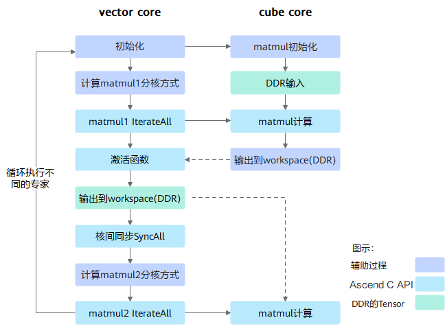
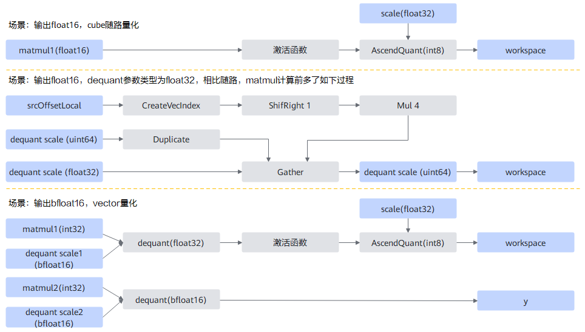
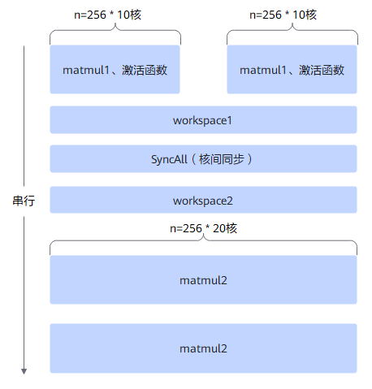
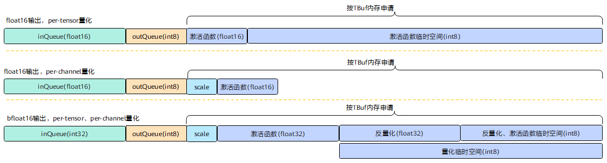
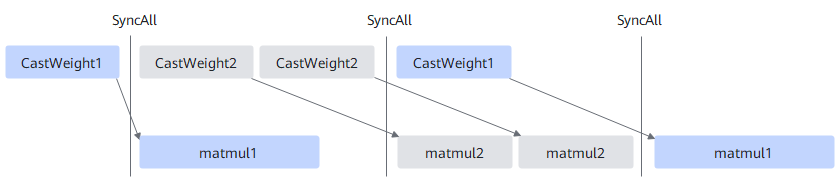

声明：本文使用[Creative Commons License version 4.0](https://creativecommons.org/licenses/by/4.0/legalcode)许可协议，转载、引用或修改等操作请遵循此许可协议。

# 1 FFN融合算子设计介绍



FFN算子核心计算过程如上图所示，计算主要由matmul1 -> 激活函数 -> matmul2组成，主体逻辑（流程控制）运行在VectorCore上。

1. 初始化过程包括tiling初始化（tiling从DDR内存拷贝到AiCore内），matmul对象和自定义对象实例化、初始化等；
2. 计算matmul1、matmul2分核方式，以充分发挥AiCore多核并行能力；
3. vector上执行matmul1、matmul2 IterateAll，发起cube上对应的matmul计算；
4. 核间同步，matmul1 -> 激活函数分核计算时，每个核只输出一小部分，核间同步是为了等所有核都完成激活函数计算后以完整数据开始计算matmul2；
5. workspace中（DDR内存）存放vector core与cube core之间需要传递的数据，如激活函数在vector core计算的结果保存在workspace中，matmul2计算从该workspace中读取数据作为输入；
6. 循环遍历不同专家进行上述计算。

除了上述计算流程，算子实现还需要考虑：

1. 支持不同的参数、数据类型，如有无bias、不同激活函数类型，非量化、量化、伪量化等不同场景；不同场景对应的计算流程不同，性能优化方法不同，因此实现上划分成了不同的模板，有各自的模板参数；
2. 硬件上AiCore内存大小有限，一般完成一个算子的计算需要对数据进行切分，并对数据搬运和计算过程进行流水并行排布，该过程对算子的影响非常大，也是性能优化阶段主要调整对象，而host上的tiling函数即是为完成该切分和流水的参数计算。

# 2 场景划分

## 2.1 非量化

非量化指x/weight1/weight2/y均为浮点数类型，如float16/bfloat16。非量化场景的计算过程相同，部分计算细节上存在差异：

1. float16场景，innerPrecise=1时，为高性能场景，此时matmul1在CubeCore上的计算输出、vector上激活函数输入输出均为float16类型；计算过程为：matmul1(float16) -> 激活函数(float16) -> matmul2(float16)；
2. float16场景，innerPrecise=0时，为高精度场景，此时matmul1在CubeCore上的计算输出、vector上激活函数输入输出均为float32类型，之后在vector上调用Cast高阶api转为float16输出到workspace（matmul2的输入为float16）；计算过程为：matmul1(float32) -> 激活函数(float32) -> Cast(float16) -> matmul2(float16)；
3. bfloat16场景，matmul1在CubeCore上的计算输出、vector上激活函数输入输出均为float32类型，之后在vector上调用Cast高阶api转为bfloat16输出到workspace（matmul2的输入为bfloat16）计算过程为：matmul1(float32) -> 激活函数(float32) -> Cast(bfloat16) -> matmul2(bfloat16)；。

三种场景，后两种场景的计算过程相同，因此非量化划分为两个模板：高性能模板(1)、高精度模板(2/3)。

## 2.2 量化

量化场景共用一个模板，以模板参数区分不同场景的计算流程。计算过程为：matmul1(int32) -> 反量化(float16/float32) -> 激活函数(float16/float32) -> 量化(float16/bfloat16) -> matmul2(int32) -> 反量化(float16/bfloat16)；

1. 输出y的数据类型为float16，dequant scale数据类型为uint64或int64，此时matmul1/matmul2(int32) -> 反量化(float16)在CubeCore上随路计算完成；
2. 输出y的数据类型为float16，dequant scale数据类型为float32，反量化高阶api不支持float32类型，因此需要现在vector上将dequant scale转为uint64类型，再执行matmul计算，同样反量化为随路计算完成；
3. 输出y的数据类型为bfloat16，dequant scale数据类型为bfloat16。

* dequant scale float32转uint64

  通过gather的方式将float32数据排放在uint64的低32中，过程如下：

  1. 生成gather所需要的index，即srcOffset；
     * 先用CreateVecIndex生成数据数列0,1,2,...,2*n-1，其中n为dequant scale的数据个数，数据类型为int32，再Cast为uint32；
     * 用ShiftRight将数列逻辑右移一位，形成数列：0,0,1,1,2,2,...,n-1,n-1；
     * 将数列乘sizeof(float32)=4，Gather的index表示地址偏移时以字节为单位；
  2. mask采用逐bit（参考Ascendc开发文档）定义mask={0x5555555555555555 & (2 ^ n -1), 0}（一次vector周期能处理8*32B，即64个float32）。实际代码中并没与2^n-1，而是通过数据搬运时跳过尾块无效数据。
  3. 用Duplicate向目标地址填充0；
  4. 用Gather数据生成符合预期的uint64数据。

  以上过程是将src(dequant scale)和dst当成uint32进行处理（不是Cast），最终输出到workspace中，matmul中以uint64类型配置。

* 总结量化场景的vector计算过程如下图：



## 2.3 伪量化

伪量化场景共用一个模板，以模板参数区分不同场景的计算流程。计算过程为：CastWeight1(float16/bfloat16) -> matmul1(float16/float32) -> 激活函数(float16/float32) -> Cast(float16) -> CastWeight2(float16/bfloat16) -> matmul2(float16)；

其中CastWeight1/2在vector通过调用高阶api完成，CastWeight2与其他数据并没有依赖，因此可以与matmul1并行；同理matmul2也可与下一个专家的CastWeight1并行（在下文介绍流程）。

# 3 tiling设计

为直观体现tiling计算的核心思路，以具体平台参数和典型输入shape为例：

* 以如下硬件信息为例：20个AICore，L0A/L0B buffer大小为64kb，L0C buffer大小为128kb；
* x/weight数据类型为float16，x[128, 5120]，weight1[8, 5120, 2560]，weight2[8, 2560, 5120]，取expert_token=[16, 16, 16, 16, 16, 16, 16, 16]。此时需要循环8个专家，每个循环需要计算matmul1：A[16, 5120] \* B[5120, 2560]，激活函数：[16, 2560]，matmul2：A[16, 2560] \* B[2560, 5120]。

FFN算子的计算过程主要为matmul1 + 激活函数 + matmul2，因此tiling参数也分为这3个部分，其中matmul计算是调用高阶api完成，对应的tiling参数主体也由对应的接口完成，FFN会根据实际算子优化效果对部分参数进行调整。

## 3.1 matmul tiling

matmul tiling分为两个部分，分核和单核内的切分，这两部分相互耦合，一般是优先考虑单核内的切分，再考虑分核。为了更高性能，AICore的一般切分计算原则是尽可能将L0(L0A/L0B/L0C) buffer用满，以减少指令数量和指令头尾开销（特殊shape另做分析）。

* 单核切分

  L0 buffer的切分在matmul tiling中为参数baseM/baseK/baseN控制。改变tiling一般不会改变实际计算量，但会改变数据的搬运次数，而性能优化的一个方向就是在优化搬运次数。从尽可能用满L0 buffer和减少搬运次数的角度出发，可以得到如下关系：

  1. 计算数据搬运比率= $\frac{baseM*baseK*baseN}{baseM*baseK+baseN*baseK}=1/(\frac{1}{baseM}+\frac{1}{baseN})$；即增加baseM/baseN即可提升计算搬运效率比，在计算量不变的情况下，即降低了搬运到L0 buffer数据量，本质上就是在尽量复用L0 buffer中的数据。
  2. L0C buffer限制：$baseM*baseN*sizeof(float)<128kb$;
  3. L0A buffer限制（开启double buffer）：$baseM*baseK*sizeof(half)<32kb$​;
  4. L0A buffer限制（开启double buffer）：$baseK*baseN*sizeof(half)<32kb$;
  5. baseM/basek/baseN尽量16对齐；
  6. 往AiCore中搬运时，连续数据尽可能为128倍数，且越接近512越好（与芯片版本有关）；

  根据第1/2/5/6，最优的baseM/baseK/baseN组合为：128/64/256，实测该tiling参数在大部分shape下都能取得更好的性能。

* 分核

  单核切分主要时考虑计算和搬运效率，分核是考虑将AiCore算力尽可能并行用起来。matmul的分核主要有m/k/n三个轴可以切分，但在k轴分核需要再额外做一次累加，或者利用DDR的atomic累加能力（支持float，如果输出是float16需要在搬运到vector做一次类型转换），在FFN算子的早期实现中尝试过该方案，性能无法达到预期，该方面没有再继续探索（该方式或许可进一步优化）。当前FFN的实现都是在m/n两个轴上进行分核，或者在专家维度上进行分核。在确定单核baseM/baseK/baseN组合为128/64/256的条件下：

  1. 按matmul1：A[16, 5120] \* B[5120, 2560]的shape，n=2560，分10核计算，单核singleN=256；
  2. 按matmul2：A[16, 2560] \* B[2560, 5120]的shape，n=5120，分20核计算，单核singleN=256；

  matmul1按最优的单核策略，只够分10核，浪费了一半的AiCore能力，matmul2与matmul1之间有数据依赖，无法将其用来算matmul2，此时有两种解决方案：

  1. 取后一个专家的matmul1来并行计算，本文档中称为专家并行分核方案；
  2. 重新调整matmul1的singleN=128或者更小，以使能多核并行计算。

  当前代码为这两种方案的组合，根据实际的shape信息进行选择。

* 专家并行分核

  按上述shape，专家并行分核的策略如下：

  

  1. 当某一个专家对应的matmul不够分满AiCore核时，空闲的那部分核用来计算第二组专家，此时workspace中同时存在两个专家的中间结果。
  2. matmul2的n足够分慢AICore核，因此采用串行的方式计算（不采用并行是考虑到m和n分核更容易造成算力分配不均从而影响性能，如下文混合并行中所述）；

* 混合并行

  专家并行存在的一个问题是，当并行的两个matmul的m轴相差较大时（n/k轴总是相等的），有一半的核会算的比较快，在SyncAll只能空闲等待，从而导致算力浪费，直观的解决方案是选取m相近的专家进行分核。结合shape信息和单核切分信息baseM：

  1. 初始化空数组tokenCache，数组最大长度为允许并行的最大专家数量，此处以2为例；
  2. 遍历token，得到当前专家matmul计算的m轴大小；
  3. 当m > baseM时，意味着m轴可以进行分核，配合n轴分核，可以分满AiCore核，此时不需要专家并行，直接完成该专家的计算；
  4. 当m <= baseM时，将当前专家信息存放在数组tokenCache中；
  5. 当tokenCache中已缓存2个专家时，启动专家并行计算，并清空tokenCache；否则回到第2步；
  6. 当遍历完所有token，tokenCache不为空时，遍历tokenCache，不进行专家并行，调整singeN=128进行分核计算；

  采用该方法，专家并行的m都是小于或等于baseM=128，差异较小，算力浪费较少。

## 3.2 vector tiling

FFN的计算里没有归约计算，因此tiling可以更灵活，一般是在matmul的tiling基础之上进行，主要考虑的因素：

1. 高效的计算过程，但FFN的vector计算过程总体比较简单、确定，该因素上没有太多优化空间；
2. UB buffer的大小，主要考虑内存复用和每次计算的数据量。

以vector的tiling参数baseM、baseN（与matmul的baseM、baseN不是同一个变量，以cubeTiling.baseM、cubeTiling.baseN区分）决定每次的vector计算量，vector的计算方式一般为两重循环。

```c++
for (int offsetM = 0; offsetM < cubeTiling.baseM; offsetM += baseM) {
    for (int offsetN = 0; offsetN < cubeTiling.baseN; offsetN += baseN) {
        int curBaseM = offsetM + baseM > cubeTiling.baseM ? cubeTiling.baseM - offsetM : baseM;
        int curBaseN = offsetN + baseN > cubeTiling.baseN ? cubeTiling.baseN - offsetN : baseN;
        VectorCompute(workspace, offsetM, curBaseM, offsetN, curBaseN);
    }
}
```

上述计算过程需要确定vector计算的baseM、baseN，同时确定UB buffer的分配复用情况。非量化、伪量化的计算过程简单，没有UB buffer的复用，而量化场景多、计算复杂，UB buffer需要复用，以提高单次计算的数据量，其复用情况如下（量化模板vector计算过程见上文）：



定义每份buffer分配的字节大小比上处理的数据个数（baseM*baseN，记为ubCalcSize）为该buffer的份数，总结不同场景的UB buffer分配情况如下：

| 场景                       | 输入 | 输出 | double buffer | temp buffer | 高阶api temp | baseM*baseN示例 | 总份数* ubCalcSize |
| -------------------------- | ---- | ---- | ------------- | ----------- | ------------ | --------------- | ------------------ |
| 高精度                     | 4    | 2    | 1             | 4           | 8            | 32*256=8kb      | 18*8kb=144kb       |
| 高性能                     | 2    | 2    | 1             | 0           | 4            | 64*256=16kb     | 8*16kb=128kb       |
| 量化输出float16            | 2    | 1    | 1             | 2           | 4            | 64*256=16kb     | 9*16kb=144kb       |
| 量化输出bfloat16           | 4    | 2    | 1             | 6           | 8            | 64*256=16kb     | 20*8kb=160kb      |
| 伪量化float16激活函数      | 2    | 2    | 2             | 0           | 4            | 32*256=8kb      | 13*8kb=104kb       |
| 伪量化float16 cast weight  | 1    | 2    | 2             | 0           | 0            | 同上            | scale按一份计入上一行总份数 |
| 伪量化bfloat16激活函数     | 4    | 2    | 2             | 4           | 6            | 32*256=8kb      | 23*8kb=184kb       |
| 伪量化bfloat16 cast weight | 1    | 2    | 2             | 0           | 6            | 同上            | scale按一份计入上一行总份数 |

说明：

1. double buffer只有输入输出涉及，体现在输入输出TQueue的内存初始化参数上；
2. temp buffer为FFN算子处理过程中要用到的UB临时空间，如激活函数(float32)->Cast(bfloat16)，激活函数的输出是在UB临时空间上；
3. 高级api temp指给高级api预留的临时空间，高阶api除了输入输出，其计算过程中也需要占用除此之外的UB buffer，一般预留2倍输入大小；
4. 为简化不同场景的计算逻辑和性能的稳定，ubCalcSize按8kb对齐；
5. 以UB大小192kb为例，最后两列给出ubCalcSize的最大取值和最终UB buffer的总占用大小；
6. 伪量化场景内存分配额外考虑scale占用一份。

# 4 流水并行

AiCore上存在多个并行单元，对应的接口有异步接口和同步接口，以充分利用硬件的并行能力。

FFN实际应用场景中计算流程上主要是Cube上的MTE2（DDR到CubeCore的数据搬运）为瓶颈点，该过程由tiling参数进行优化（如上文所述），此外vector上的激活函数的时间总体占比小于5%，因此在非量化和量化场景中，没有专门针对该场景进行CV（CubeCore和VectorCore）并行的优化，复杂的流水并行设计主要在伪量化场景上，该场景在matmul计算前需要对权重进行反量化，该过程在VectorCore且极为耗时。

## 4.2 伪量化流水并行

伪量化主要是VectorCore上的CastWeight与CubeCore上的matmul的并行计算。



1. 上述示例流程中CastWeight1与matmul2并行（除首次），CastWeight2与matmul1并行（除最后一次）；
2. 3个SyncAll，其中matmul1前面的SyncAll是等待所有VectorCore完成CastWeight1（weight的反量化过程）；matmul2前面的SyncAll为等待所有VectorCore完成激活函数和CastWeight2过程；
3. 上述示例流程中matmul1为两专家并行，matmul2串行；示例中两个CastWeight2均与matmul1并行，而不是第二个CastWeight2与第一个matmul2并行，是因为matmul1单核计算量为matmul2的两倍（以上文中shape为例，baseN相同，matmul1的k轴为matmul2的k轴两倍），计算时间足够长，且实际测试都与matmul1并行效果更好。
