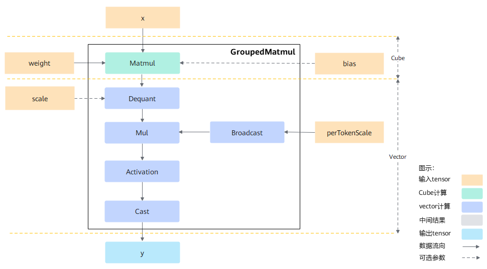
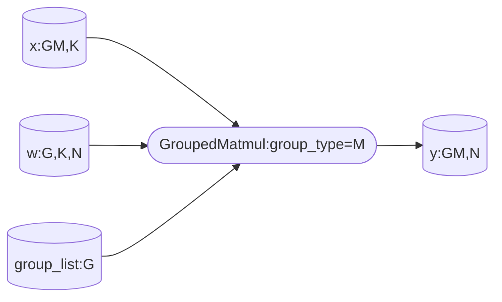
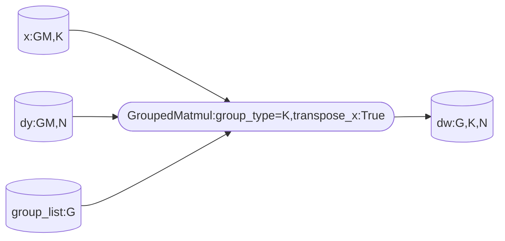
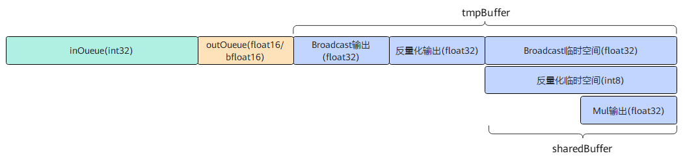
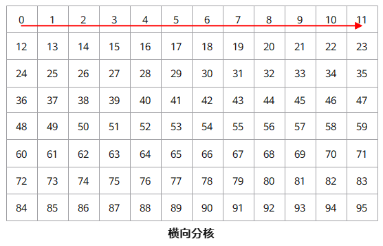
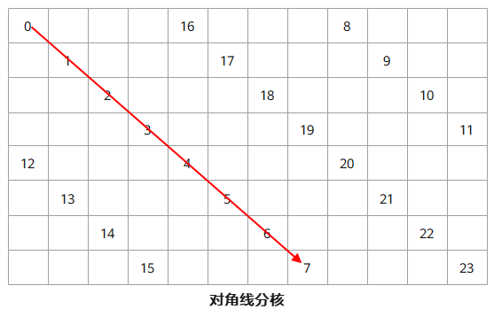
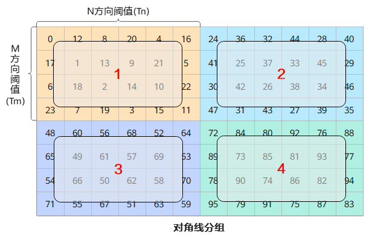

声明：本文使用[Creative Commons License version 4.0](https://creativecommons.org/licenses/by/4.0/legalcode)许可协议，转载、引用或修改等操作请遵循此许可协议。

# 1 GroupedMatmul融合算子设计介绍

GroupedMatmul算子的功能是进行分组矩阵乘计算，每组矩阵乘的维度大小可以不同。矩阵乘公式如下：
$$
y_i[m_i,n_i]=x_i[m_i,k_i] \times weight_i[k_i,n_i], i=1...g
$$
其中g为分组个数，$m_i、k_i、n_i$为对应shape。
GroupedMatmul算子实现时还需要考虑如下两个方面：
1. 支持不同的参数、数据类型，如有无bias、不同激活函数类型，非量化、量化、伪量化等不同场景；不同场景对应的计算流程不同，性能优化方法不同，因此实现上划分成了不同的模板，有各自的模板参数；
2. 硬件上AiCore内存大小有限，一般完成一个算子的计算需要对数据进行切分，并对数据搬运和计算过程进行流水并行排布，该过程对算子的影响非常大，也是性能优化阶段主要调整对象，而host上的tiling函数即是为完成该切分和流水的参数计算。
# 2 场景划分
从功能角度可分为非量化场景、量化场景和伪量化场景，代码层面通过三种方式选择具体模板：
1.编译宏：通过x和weight的数据类型编译的宏ORIG_DTYPE_X，ORIG_DTYPE_WEIGHT；
2.tilingkey：如x/weight是否转置；
3.tilingData：如tiling中isPerTokenQuant表示是否为per token量化。
说明：
- 非量化指x、weight、y均为浮点数类型，如float16/bfloat16/float32，非量化为纯cube场景，其计算过程由matmul高阶api实现；
- 量化指x和weight为低精度整数类型，GroupMatmul支持A8W8场景，包括重量化、per tensor + per channel量化和per token + per channel量化(简称per token量化)；
- 伪量化指x为浮点数类型，weight为低精度整数类型，GroupedMatmul支持A16W8和A16W4场景。

## 2.1 per token量化
本章以per token量化场景为例介绍一下GroupMatmul的算法流程，计算过程如下：
matmul(int32) -> 反量化(fp32) -> mul(fp32) -> 激活函数(fp32)(可选) -> cast(fp16/bf16)，其中mul(fp32)的输入perTokenScale还需要从shape(m) broadcast成(m，n)。



## 2.2 分组方式
针对不同场景，GroupMatmul可分为m轴分组和k轴分组，又称切M，切K。在正向训练过程对m轴进行分组，在反向计算梯度时就需要对k轴进行分组。
- m轴分组：$k_i$各组相同，$weight_i/y_i$可以在$n_i$上拼接，此时group type = 0;
m轴分组可用于非量化正向训练场景，量化场景和伪量化场景。

- k轴分组：$k_i$各不相同，但$m_i/n_i$每组相同，此时$x_i/weight_i$可以在$k_i$上拼接。k轴分组仅用于非量化训练场景，用于求损失关于weight的梯度，由于求weight梯度时需要对x进行转置，因此转置后就从x就从m轴分组变为k轴分组。

## 2.3 多tensor/单tensor支持
GroupedMatmul算子支持输入输出为多tensor、单tensor。
单tensor指一个tensor list中所有分组的tensor在groupType指定的分组轴上合并为1个；否则为多tensor。
下表介绍了不同方案tensor支持的shape，其中单表示单tensor，多表示多tensor，表示顺序为x，weight，y，例，单多单表示支持x为单tensor，weight多tensor，y单tensor的场景。
| group_type | supported scenario | x shape | weight shape | y shape | optional-dynamic inputs shape if needed | group_list shape if passed | per_token_scale shape if passed |
| :--------: | :----------------: | :-----: | :----------: | :-----: | :-------------------------------------: | :------------------------: | :-----------------------------: |
| -1         |        多多多         | [(M1,K1),(M2,K2),...] | [(K1,N1),(K2,N2),...] | [(M1,N1),(M2,N2),...] | [(N1),(N2),...] | not support | not support |
| 0          |        单单单         | [(M,K)] | [(G,K,N)] | [(M,N)] | [(G,N)] | (G) | (M) |
| 0          |        单多单         | [(M,K)] | [(K,N),(K,N),...] | [(M,N)] | [(N),(N),...] | (G) | not support |
| 0          |        多多单         | [(M1,K1),(M2,K2),...] | [(K1,N),(K2,N),...] | [(M,N)] | [(N),(N),...] | (G) | not support |

例如在多多多场景，x shape={{4，16}, {12，16}, {16，16}}，weight shape={{16，8}，{20，8}，{24，8}}，y shape={{4，8}，{12，8}，{16，8}}，如果想在单单单场景进行相同的计算，则x shape={32，16}，weight shape= {3，16，8}，y shape={32，8}，groupList={4，12，16}。 

# 3 tiling设计
## 3.1 tilingData设计
```c++
BEGIN_TILING_DATA_DEF(GMMTilingData)
  TILING_DATA_FIELD_DEF_STRUCT(GMMBaseParams, gmmBaseParams);
  TILING_DATA_FIELD_DEF_STRUCT(GMMArray, gmmArray);
  TILING_DATA_FIELD_DEF_STRUCT(TCubeTiling, mmTilingData);
END_TILING_DATA_DEF;
```

tilingData主要包含上述结构里的三个部分：
1. GMMBaseParams: GroupedMatmul的分组数量、Aicore核数、ub tiling参数、matmul分核tiling参数等基础tiling参数，是否有激活函数、量化类型（per token或per tensor）、激活函数类型等功能参数;
2. GMMArray: 当输入是多tensor时，通过三个数组记录每组Matmul的shape, kernel通过GlobalTensor::GetValue()的方式获取。当输入为全单tensor时，m/k/n中的一个值在group_list中，另外两个值在所有的group中都相同，此时kernel只需要访问数组中的第一个值。
3. TCubeTiling: matmul高阶api对应的tilingData。

kernel中为了避免在栈空间中申请GMMArray中3个数组以及避免拷贝这些数组，采用GET_TILING_DATA_MEMBER接口拷贝除GMMArray之外的结构体。

## 3.2. UB buffer分配
在初始化阶段，GroupedMatmul需要确定UB buffer的分配复用情况。非量化、伪量化的计算过程简单，没有UB buffer的复用，而量化场景多、计算复杂，UB buffer需要复用，以提高单次计算的数据量。
定义每份buffer分配的字节大小比上处理的数据个数（baseM\*baseN，记为ubCalcSize，此处baseM/baseN为vector计算的参数）为该buffer的份数，以per token量化为例，假设baseM = 24, baseN = 256，则ubCalcSize = baseM * baseN = 6kb。

UB buffer分配如下：



1. vector计算的输入即matmul的输出的类型为int32，在开启doubleBuffer之后输入需要sizeof(int32) * 2，即8份buffer；
2. vector计算的输出为fp16/bf16，其需要sizeof(fp16/bf16) * 2，即4份buffer；
3. vector计算的中间计算过程需要申请tmpBuffer，其中broadcast的输出需要sizeof(fp32)块buffer，反量化的输出sizeof(fp32)块buffer，还需申请sharedBuffer进行buffer复用，包含broadcast临时空间、反量化临时空间和Mul输出，大小为8块buffer，共需要申请tmpBuffer的大小为16块buffer。

总共需要分配的UB buffer为28 * 6kb = 168kb。

## 3.3 基本块分核方案
GroupedMatmul实现时需要考虑输入为多个tensor的情况，即每组matmul的shape可能各不相同，而kernel侧不能为每组matmul单独配置对应的matmul高阶api接口实例（tiling结构体和core栈空间大小均不允许）。为了适配不同shape的matmul计算，Groupedmatmul采用基本块方式（横向分核），以baseM、baseN为基本块进行分核计算，此处baseM/baseN为matmul的参数。



## 3.4 对角线分核方案
按基本块方案进行分核，容易存在同地址访问的问题，例如当基本块方案中nDim=coreNum时，则同一时间所有的核都在访问左矩阵的相同地址，对性能影响较大。因此当基本块数量超过coreNum时（没超过coreNum时，对角线方案无法解决同地址访问问题），可以采用如下对角线方案，同一时间不同核尽量错开对数据的访问，每个方块代表一个输出的基本块，数字代表基本块遍历顺序（横向分核为原始基本块分核方案）。



对于适合对角线优化的场景，在基本块方案上输入数据会存在多次访问，当nDim/mDim很大时，"对角线"不能直接任意往下延伸，否则在k值比较大的场景下，对角线上对应的输入数据均为不同的数据，已经加载过一次的数据被新数据从L2 cache中替换掉，后续需要加载时还是从DDR内存中加载，导致性能劣化。因此需要限制对角线范围，以充分利用L2 cache中缓存的数据。



将对角线遍历按阈值进行分组，为尽量避免同地址访问，两个方向的阈值最好都不小于实际的物理核数，因此有：
$$
\min(T_m, T_n) \geq numCore
$$

为充分利用cache，一个分组块对应的$X$、$Weight$、$Y$的总数据量最好不超过设备的L2 cache大小，因此有:
$$
sizeof(dtype) \cdot (T_m \cdot singleM \cdot K + K \cdot T_n \cdot singleN + T_m \cdot singleM \cdot T_n \cdot singleN) \leq L2_{size}
$$
若两个条件不能同时满足，须根据实际情况做取舍。