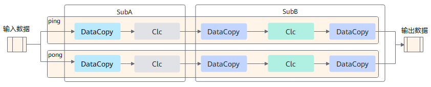
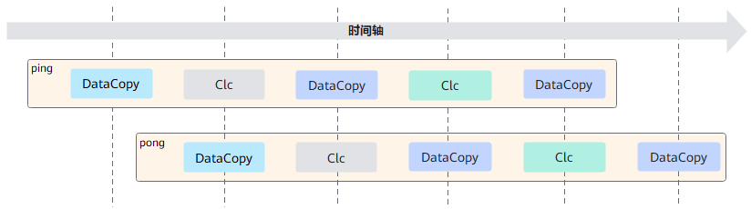
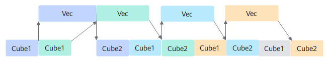
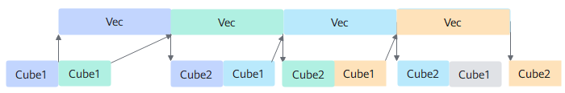

声明：本文使用[Creative Commons License version 4.0](https://creativecommons.org/licenses/by/4.0/legalcode)许可协议，转载、引用或修改等操作请遵循此许可协议。

# PromptFlashAttention算子设计介绍

## 1 模板化设计

为了使不同的输入可以复用相同的tiling和流水，采用了模板的方式来实现融合算子，但是不同的输入全部使用同一套模板时又无法达到性能最优和功能泛化，因此需要根据输入shape的特征区分不同的模板来实现。融合算子的多模板设计思路主要为：

- **根据核内及核间切分进行模板拆分**

  由于硬件buffer大小是有限的，而计算的数据量又是巨大的，无法一次计算完，那么就需要进行tiling切分，shape不同会导致算子的切分轴不同，而算子的切分轴，会影响模板的功能及性能。往往需要根据切分轴进行模板拆分，模板拆分时为了达到性能最优，需要考虑如下几个点：

  a. 将核心的数量用满，防止部分核闲置 

  b. 每一个核心被分配的计算量相对均匀，避免出现某些核计算的数据量过大，其余核在围观的情况。

  c. AIC和AIV之间处理的数据量要符合其对应的算力，避免AIC或AIV出现长时间的空闲。 

  PromptFlashAttention算子包含B、N2(key和value的N)、G(query_N/kv_N)、S1(query的S)、S2(key和value的S)共5个轴，切分顺序是先核内再核间，核内切分依据基本块大小选择切分轴，核间切分是把核内切分后剩余的轴合并后依据AI Core核数再进行切分。


- **根据特殊场景及特定优化进行模板特化**

  每一个融合算子有一个基础模板，并辅以多个特化模板：

  - 基础模板覆盖功能以及大部分此类shape特征输入的性能。
  - 特化模板是覆盖特定场景的极致性能，主要根据某些适用于特定场景的特殊手段进行的优化，不适合进行泛化。

  例如，根据特殊场景空tensor特化而出的empty_input模板，基于角色的cube核管理（RCM）优化方案设计的确定性计算模板等。

- **根据不同计算流水进行模板特化**

  为了充分发挥硬件优势，通常融合算子都需要进行流水设计，以提高融合算子性能，不同的流水设计对代码的架构影响非常大，为了提升代码的可维可测可读性，需要根据不同的计算流水进行模板特化，达到特定场景的性能优化。

## 2 tiling设计

Tiling操作的目的是为了找到一种更高效的NPU执行方式，原始的数据量一般是非常大的，没有办法通过一次指令调用就完成所有计算，因此需要将数据量分到多个核上并行计算，且每个核上也需要考虑如何循环计算性能最优，不同的输入可能有不同的最优执行方式，所以需要通过tiling策略决定怎么将数据分配到各个核上进行计算。

### 2.1 CV Tiling分离设计

 根据硬件架构特征，AI Core分成AIC和AIV两个独立的核，AIC和AIV核拥有自己独立的Scalar计算单元，能够独立加载自己的代码段，单独执行。AIC和AIV分离的架构可以使得AIC和AIV并行执行。AIC和AIV之间数据交互的通路是L2和HBM（High Bandwidth Memory，高带宽存储器），两者之间的交互次数对性能影响是比较大的，同时由于AIC和AIV算力差异，两者需要使用不同的基本块大小，本着尽量减少AIC和AIV通信次数和发挥最大算力的原则，CVtiling分离策略应运而生，可以有效地减少CV通信次数，同时根据不同单元的buffer特征，选择不同的基本块进行计算，从而提升算子性能。

 对于PromptFlashAttention算子，Vector计算涉及多个输入、输出、中间计算结果、double-buffer设计等，需要将buffer分配成多份，最优分配方案中最大一份为32KB，由于Vector计算使用的数据类型是float32，因此Vector的tiling基本块为8 * 1024。为了充分发挥Cube的算力，在CV之间一轮计算的数据量进行了1:16的配比，又由于Cube侧的输入数据类型是float16，输出是float32，cube的基本块为128 * 128，所以通过nRation=8配比出128 * 1024的数据量。伪码如下：

```c++
// C-Tiling: (S1_c_i,D)x(D,S2_c_i) => (S1_c_i, S2_c_i):(128,1024)
// V-Tiling: (S1_v_i, S2_v_i) => (8,1024)

// C侧 matmul计算
Bmm((S1_c_i,D)x(D,S2_c_i)) => 128*1024  // 输出结果128*1024，放到workspace上
// V侧 vector计算
for S1_c_i/S1_v_i=128/8:
	copy_gm_to_ub(S1_v_i*S2_v_i)  // 从bmm的workspace上拷入bmm结果数据
	vector(S1_v_i,S2_v_i)         // 进行vector计算
	copy_ub_to_gm(S1_v_i*S2_v_i)  // vector计算结束，得到最终输出数据，拷贝到GM上

// 由于cube侧计算数据比vector侧大，因此，ub内需要再次进行Vector Tiling，从而产生了S1方向的配比：S1_c_i/S1_v_i
```

上述示例中，仅在S1方向开了配比，S2方向C/V计算的长度是一致的，当然，也可以在S1/S2方向均开启配比；这样做的好处是，Cube一次可以发射大块的数据，避免因为小块数据不断发射带来的通信开销，也能最大程度地使用Cube单元的buffer。

### 2.2 tilingkey设计

为了在运行态实例化一个确定的模板，需要通过tilingkey来唯一标识 。tilingkey生成实现如下：

```c++
constexpr uint64_t TILINGKEYOFFSET = uint64_t(10000000000000000000);  // 10^19
uint64_t GetTilingKey() const override {
    return GET_TILINGKEY(AxisEnum::S1, AxisEnum::S2, AxisEnum::NONE, implMode,
                         tilingKeyDType, tilingKeyLayout, tilingKeyBmm1Format,
                         SparseEnum::ANY, PerformanceOrientedEnum::BIG_DOUBLE_BUFFER,
                         hasDropOut, hasAttenMask, hasPse, enableL1Reuse);
}

template <typename... Args>
constexpr uint64_t GET_TILINGKEY(Args... templateIds) {
  return TILINGKEYOFFSET + RecursiveSum(templateIds...);
}

template <typename T, typename... Args>
constexpr uint64_t RecursiveSum(T templateId, Args... templateIds) {
  return static_cast<uint64_t>(templateId) + 10 * RecursiveSum(templateIds...);
}
```

**tilingKey生成规则**：按十进制位组装tilingkey，最多支持19个参数，tilingkey的个字段根据模板具体功能进行填充，
使得每个模板特例对应唯一的tilingkey


**其余特化场景，可以依次在后面定义自己的位域和值。**

## 3 流水设计

为了追求极致性能，必须充分利用硬件资源，通常需要进行不同pipeline的流水设计。流水设计的宗旨是尽量使某一条pipeline达成bound效果，使硬件的某一个单元一直在工作，达到性能上限。

### 3.1  V侧流水

V侧流水设计需要考虑Vector内部的搬运及计算过程，实施的优化手段主要是double buffer。
以下面的流水任务示意图为例，Vec的功能被拆分成2个流水任务：subA、subB，每个任务专注于完成单一功能；需要处理的数据被切分成2片，使用ping-pong表示两个数据处理任务，每个任务需要依次搬运DataCopy与计算Clc操作。任务间的箭头表达数据间的依赖关系，比如subA处理完DataCopy之后，subB才能对Clc进行处理。
从图上可以看出，不进行流水设计时，搬运与计算任务之间是串行执行的，会出现断流现象，即第一次DataCopy完成之后的搬运流水就一直处于空闲状态，直到第一次搬入的数据计算完成并搬出之后搬运流水才会继续工作，进行第二次DataCopy（Vector计算和搬出流水也存在同样问题）。通常这种情况下，性能是极差的。


将上图的流水任务做ping-pong流水间的double buffer处理后，流水任务运行起来的示意图如下，从运行图中可以看出，对于同一片数据，搬运DataCopy与计算Clc之间的处理具有依赖关系，需要串行处理；不同的数据切片，同一时间点，可以有多个任务在并行处理，由此达到任务并行、提升性能的目的。



实现伪码如下：

```python
def Vec():
    subA(ping) # 表示计算ping小块
    subA(pong) # 表示计算pong小块
    subB(ping) # 表示计算ping小块
    subB(pong) # 表示计算pong小块
```

其中ping、pong两块计算数据所占用的内存资源均相互独立。
​PromptFlashAttention类融合算子V侧计算过程较多，情况也比较复杂，通常简单的double buffer是无法覆盖所有情况的，因此会出现不同的计算流水排布。不同的计算流水适用于不同类的shape特征，以达到在该类特征下最好的流水设计。

### 3.2 CV流水


融合算子通常包含了Vector计算和Cube计算，对于PromptFlashAttention算子，V侧的计算是依赖C侧的计算结果的，如果只关注V侧流水，不关注C侧，则C侧与V侧很有可能是串行流水的效果，不能达到并行计算的目的，无法使得融合算子性能达到最优，从而有了CV流水设计。此外，CV流水在不同算子情况下，表现的现象也是不一致的，PromptFlashAttention的Cube双发机制可实现两种场景下的流水优化：


- C侧总耗时 > V侧总耗时

  该场景流水特征下，Vector计算节点少，计算速度快，在Atlas A2训练系列产品/Atlas 800I A2推理产品 C:V=1:2的情况下，Cube的搬运时长足以掩盖Vector的计算时长，因此只要关注Cube的MTE2耗时即可，最终达成MTE2 bound。在Cube双发机制下，提前发射两块Cube计算，Cube1、Cube2计算可以衔接，使得Cube利用率最高，达成Cube bound。

  

- C侧总耗时 < V侧总耗时 

  该场景流水特征下，Vector计算节点多，Vector计算是瓶颈，C侧的搬运不足以掩盖V侧的流水，因此需要进行CV流水排布，尽量达到CV并行的效果，最通用的优化手段是C侧提前发射。

  

  C侧连续发射两块Cube计算，这样可以保证V侧计算完上一轮时，可以立马启动当前轮的计算，而不用等待Cube1的数据。这样可以使V侧一直在工作，达成Vector bound。