声明：本文使用[Creative Commons License version 4.0](https://creativecommons.org/licenses/by/4.0/legalcode)许可协议，转载、引用或修改等操作请遵循此许可协议。

# sparseModeOptional参数说明

本节给出sparseModeOptional参数不同取值场景下的模式说明。

| sparseModeOptional | 含义                            | 备注           |
|--------------------|-------------------------------|--------------|
| 0                  | defaultMask模式。                | -            |
| 1                  | allMask模式。                    | -            |
| 2                  | leftUpCausal模式。               | -            |
| 3                  | rightDownCausal模式。            | -            |
| 4                  | band模式。                       | -            |
| 5                  | prefix非压缩模式。                  | varlen场景不支持。 |
| 6                  | prefix压缩模式。                   | -            |
| 7                  | varlen外切场景，rightDownCausal模式。 | 仅varlen场景支持。 |
| 8                  | varlen外切场景，leftUpCausal模式。    | 仅varlen场景支持。 |

attenMask的工作原理为，在Mask为True的位置遮蔽query(Q)与key(K)的转置矩阵乘积的值，示意如下：
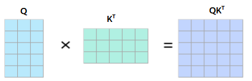

$QK^T$矩阵在attenMask为Ture的位置会被遮蔽，效果如下：

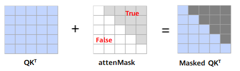

- sparseModeOptional为0时，代表defaultMask模式。

  - 不传mask：如果attenMaskOptional未传入则不做mask操作，attenMaskOptional取值为None，忽略preTokensOptional和nextTokensOptional取值。Masked $QK^T$矩阵示意如下：

     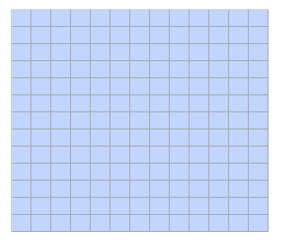
  - nextTokensOptional取值为0，preTokensOptional大于等于Sq，表示causal场景sparse，attenMaskOptional应传入下三角矩阵，此时preTokensOptional和nextTokensOptional之间的部分需要计算，Masked $QK^T$矩阵示意如下：
     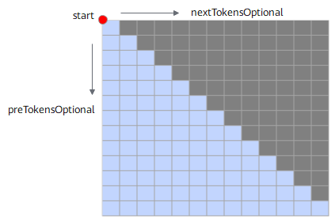 

     attenMaskOptional应传入下三角矩阵，示意如下：

     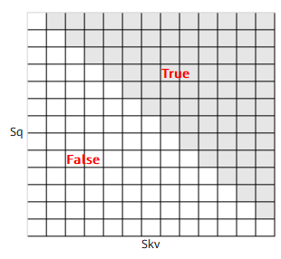
  - preTokensOptional小于Sq，nextTokensOptional小于Skv，且都大于等于0，表示band场景，此时preTokensOptional和nextTokensOptional之间的部分需要计算。Masked $QK^T$矩阵示意如下：
     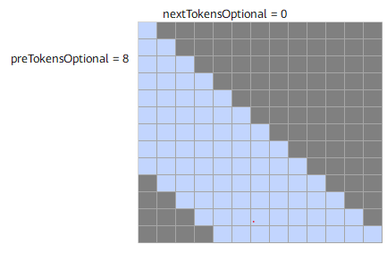 

     attenMaskOptional应传入band形状矩阵，示意如下：

     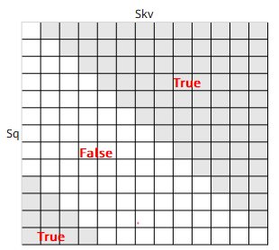
  - nextTokensOptional为负数，以preTokensOptional=9，nextTokensOptional=-3为例，preTokensOptional和nextTokensOptional之间的部分需要计算。Masked $QK^T$示意如下：
     **说明：nextTokensOptional为负数时，preTokensOptional取值必须大于等于nextTokensOptional的绝对值，且nextTokensOptional的绝对值小于Skv。**
     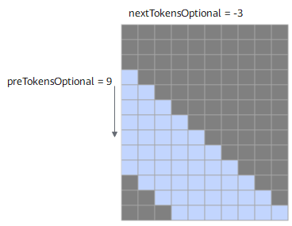 
  - preTokensOptional为负数，以nextTokensOptional=7，preTokensOptional=-3为例，preTokensOptional和nextTokensOptional之间的部分需要计算。Masked $QK^T$示意如下：
     **说明：preTokensOptional为负数时，nextTokensOptional取值必须大于等于preTokensOptional的绝对值，且preTokensOptional的绝对值小于Sq。**
     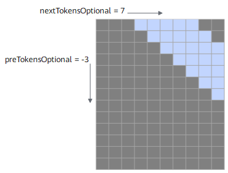 
- sparseModeOptional为1时，代表allMask，即传入完整的attenMaskOptional矩阵。该场景下忽略nextTokensOptional、preTokensOptional取值，Masked $QK^T$矩阵示意如下：

  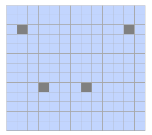 
- sparseModeOptional为2时，代表leftUpCausal模式的mask，对应以左上顶点划分的下三角场景（参数起点为左上角）。该场景下忽略preTokensOptional、nextTokensOptional取值，Masked $QK^T$矩阵示意如下：

  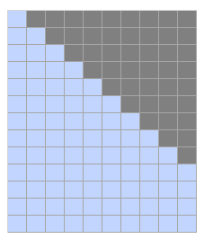

  传入的attenMaskOptional为优化后的压缩下三角矩阵（2048*2048），压缩下三角矩阵示意（下同）：
  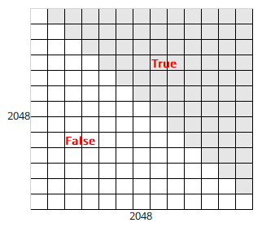 
- sparseModeOptional为3时，代表rightDownCausal模式的mask，对应以右下顶点划分的下三角场景（参数起点为右下角）。该场景下忽略preTokensOptional、nextTokensOptional取值。attenMaskOptional为优化后的压缩下三角矩阵（2048*2048），Masked $QK^T$矩阵示意如下：

  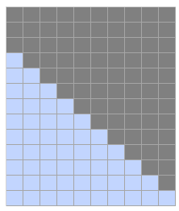
- sparseModeOptional为4时，代表band场景，即计算preTokensOptional和nextTokensOptional之间的部分，参数起点为右下角，preTokensOptional和nextTokensOptional之间需要有交集。attenMaskOptional为优化后的压缩下三角矩阵（2048*2048）。Masked $QK^T$矩阵示意如下：

  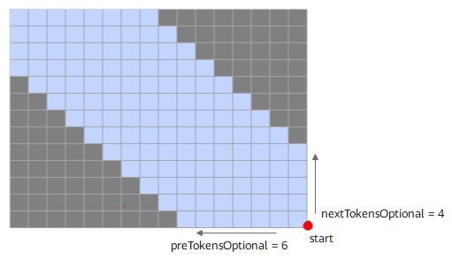
- sparseModeOptional为5时，代表prefix非压缩场景，即在rightDownCasual的基础上，左侧加上一个长为Sq，宽为N的矩阵，N的值由可选输入prefix获取，例如下图中表示batch=2场景下prefix传入数组[4,5]，每个batch轴的N值可以不一样，参数起点为左上角。
  该场景下忽略preTokensOptional、nextTokensOptional取值，attenMaskOptional矩阵数据格式须为BNSS或B1SS，Masked $QK^T$矩阵示意如下：

  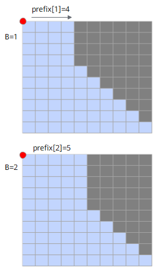

  attenMaskOptional应传入矩阵示意如下：

  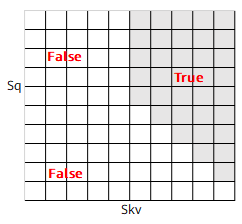
- sparseModeOptional为6时，代表prefix压缩场景，即prefix场景时，attenMask为优化后的压缩下三角+矩形的矩阵（3072*2048）：其中上半部分[2048，2048]的下三角矩阵，下半部分为[1024,2048]的矩形矩阵，矩形矩阵左半部分全0，右半部分全1，attenMaskOptional应传入矩阵示意如下。该场景下忽略preTokensOptional、nextTokensOptional取值。
  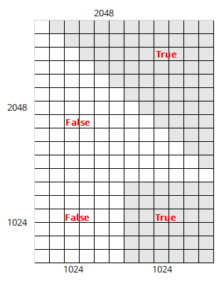
- sparseModeOptional为7时，表示varlen且为长序列外切场景（即长序列在模型脚本中进行多卡切query的sequence length）；用户需要确保外切前为使用sparseModeOptional 3的场景；当前mode下用户需要设置preTokensOptional和nextTokensOptional（起点为右下顶点），且需要保证参数正确，否则会存在精度问题。
  Masked $QK^T$矩阵示意如下，在第二个batch对query进行切分，key和value不切分，4x6的mask矩阵被切分成2x6和2x6的mask，分别在卡1和卡2上计算：

   - 卡1的最后一块mask为band类型的mask，配置preTokensOptional=6（保证大于等于最后一个Skv），nextTokensOptional=-2，actual_seq_qlen应传入{3,5}，actual_seq_kvlen应传入{3,9}。
   - 卡2的mask类型切分后不变，sparseModeOptional为3，actual_seq_qlen应传入{2,7,11}，actual_seq_kvlen应传入{6,11,15}。
  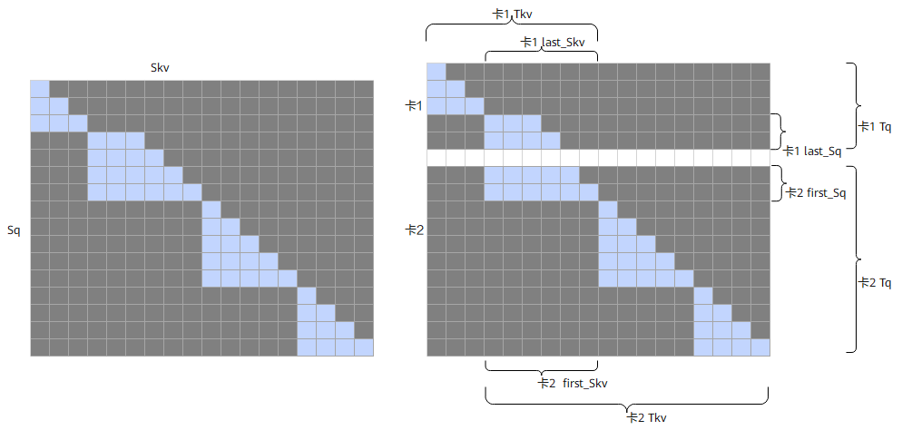

  **说明**：
    - sparseModeOptional=7，band表示的是最后一个非空tensor的Batch的sparse类型；如果只有一个batch，用户需按照band模式的要求来配置参数；sparseModeOptional=7时，用户需要输入2048x2048的下三角mask作为该融合算子的输入。
    - 基于sparseModeOptional=3进行外切产生的band模式的sparse的参数应符合以下条件：
       - preTokensOptional >= last_Skv。
       - nextTokensOptional <= 0。
       - 当前模式下不支持可选输入pse。
- sparseModeOptional为8时，表示varlen且为长序列外切场景；用户需要确保外切前为使用sparseModeOptional 2的场景；当前mode下用户需要设置preTokensOptional和nextTokensOptional（起点为右下顶点），且需要保证参数正确，否则会存在精度问题。
  Masked $QK^T$矩阵示意如下，在第二个batch对query进行切分，key和value不切分，5x4的mask矩阵被切分成2x4和3x4的mask，分别在卡1和卡2上计算：

  - 卡1的mask类型切分后不变，sparseModeOptional为2，actual_seq_qlen应传入{3,5}，actual_seq_kvlen应传入{3,7}。
  - 卡2的第一块mask为band类型的mask，配置preTokensOptional=4（保证大于等于第一个Skv），nextTokensOptional=1，actual_seq_qlen应传入{3,8,12}，actual_seq_kvlen应传入{4,9,13}。
    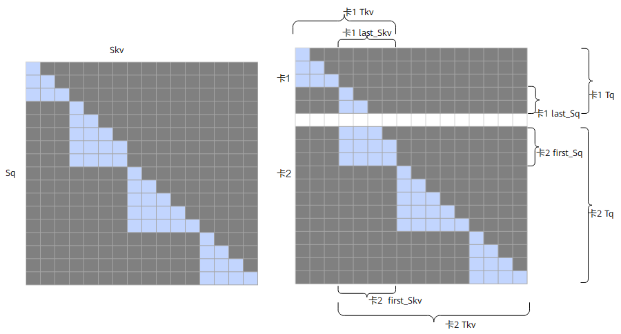

  **说明**：
    - sparseModeOptional=8，band表示的是第一个非空tensor的Batch的sparse类型；如果只有一个batch，用户需按照band模式的要求来配置参数；sparseModeOptional=8时，用户需要输入2048x2048的下三角mask作为该融合算子的输入。
    - 基于sparseModeOptional=2进行外切产生的band模式的sparse的参数应符合以下条件：
       - preTokensOptional >= first_Skv。
       - nextTokensOptional范围无约束，根据实际情况进行配置。
       - 当前模式下不支持可选输入pse。

