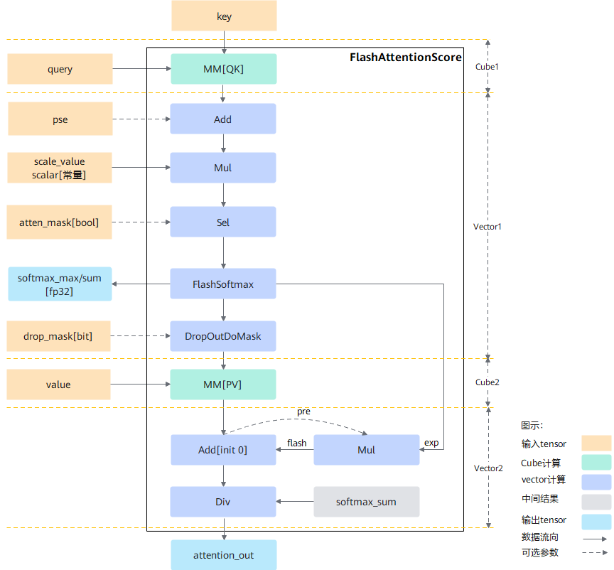

声明：本文使用[Creative Commons License version 4.0](https://creativecommons.org/licenses/by/4.0/legalcode)许可协议，转载、引用或修改等操作请遵循此许可协议。

# 融合算子源码导读

本文以FA算子的example为例进行源码导读，FA的example示例代码详见[examples/transformer/flash_attention_score/test_flash_attention_score.cpp](../../examples/transformer/flash_attention_score/test_flash_attention_score.cpp)，FA算子源码路径[src/transformer/flash_attention_score/](../../src/transformer/flash_attention_score)。

## 单算子调用示例

```c++
int main() {
  // 1.调用acl进行device/context/stream初始化
  auto init_status = aclnnInit();
  ...
  
  std::vector<int64_t> qShape = {2048, 1, 128};
  std::vector<int64_t> kShape = {2048, 1, 128};
  std::vector<int64_t> vShape = {2048, 1, 128};
  int64_t headNum = 1;
  char *layOut = "SBH";
  // 2.调用aclnnFlashAttentionScore第一段接口
  auto call_status = aclnnFlashAttentionScoreGetWorkspaceSize(..., &workspace_size, &op_executor);
  ...
  
  // 3.调用aclnnFlashAttentionScore第二段接口
  call_status = aclnnFlashAttentionScore(workspaceAddr, workspaceSize, executor, stream);

  // 4.同步等待任务执行结束
  ret = aclrtSynchronizeStream(stream);

  // 5.释放aclTensor、device等资源
  ...
  
  return 0;
}
```

示例中，layout为SBH，对应B：1，N：1，G：1，S1：2048，S2：2048，D：128。

## 第一段接口流程介绍

接口实现所在文件[src/transformer/flash_attention_score/ophost/aclnn_flash_attention_score.cpp](../../src/transformer/flash_attention_score/ophost/aclnn_flash_attention_score.cpp)。

在一段接口aclnnFlashAttentionScoreGetWorkspaceSize中，首先通过AnalysisInput完成对输入的合法性校验和输入的解析，然后对输入按需进行预处理，包含reshape、padding、transpose等；最后调用[src/transformer/flash_attention_score/ophost/flash_attention_score.cpp](../../src/transformer/flash_attention_score/ophost/flash_attention_score.cpp)中的FA接口，接口定义如下：

```C++
const std::array<const aclTensor *, 4> FlashAttentionScore(
    const aclTensor *query, const aclTensor *key, const aclTensor *value,
    const aclTensor *realShiftOptional, const aclTensor *dropMaskOptional,
    const aclTensor *paddingMaskOptional, const aclTensor *attenMaskOptional,
    const aclIntArray *prefixOptional, const aclIntArray *actualSeqQLenOptional,
    const aclIntArray *actualSeqKvLenOptional, double scaleValueOptional,
    double keepProbOptional, int64_t preTockensOptional, int64_t nextTockensOptional,
    int64_t headNum, const char *inputLayout, int64_t innerPreciseOptional,
    int64_t sparseModeOptional, aclOpExecutor *executor)
```

该接口完成infershape、tiling等动作：

- InferShape：主要作用是基于算子输入信息，推导出算子的输出shape，FA算子的infershape推导实现在 [src/transformer/flash_attention_score/ophost/flash_attention_score_proto.cpp](../../src/transformer/flash_attention_score/ophost/flash_attention_score_proto.cpp)中。
- tiling：大多数情况下，Local Memory的存储，无法完整的容纳算子的输入与输出，需要每次搬运一部分输入进行计算然后搬出，再搬运下一部分输入进行计算，直到得到完整的最终结果，这个数据切分、分块计算的过程称之为**Tiling**。根据算子的shape等信息来确定数据切分算法相关参数（比如每次搬运的块大小，以及总共循环多少次）的计算程序，称之为**Tiling实现。**

FA的Tiling实现入口在[src/transformer/flash_attention_score/ophost/flash_attention_score_tiling.cpp](../../src/transformer/flash_attention_score/ophost/flash_attention_score_tiling.cpp)文件中，函数如下：

```C++
ASCENDC_EXTERN_C ge::graphStatus TilingFlashAttentionScore(gert::TilingContext *context) 
```

其入参TilingContext为框架传入的tiling上下文信息，包含了算子输入、输出、属性、编译信息、platform信息等；该函数中首先会对框架传入的TilingContext参数进行合法性校验，然后区分空Tensor场景和非空Tensor场景进行tiling。

- 空Tensor场景处理，函数如下：

  ```C++
  bool IsEmptyInput(gert::TilingContext *context)
  ```

- 非空Tensor场景的tiling流程如下：

  ```C++
    ge::graphStatus DoTiling() {
      auto ret = GetShapeAttrsInfo();
      if (ret != ge::GRAPH_SUCCESS) {
        return ret;
      }
      ret = GetPlatformInfo();
      if (ret != ge::GRAPH_SUCCESS) {
        return ret;
      }
      if (!IsCapable()) {
        return ge::GRAPH_PARAM_INVALID;
      }
      ret = DoOpTiling();
      if (ret != ge::GRAPH_SUCCESS) {
        return ret;
      }
      ret = DoLibApiTiling();
      if (ret != ge::GRAPH_SUCCESS) {
        return ret;
      }
      ret = GetWorkspaceSize();
      if (ret != ge::GRAPH_SUCCESS) {
        return ret;
      }
      ret = PostTiling();
      if (ret != ge::GRAPH_SUCCESS) {
        return ret;
      }
      context_->SetTilingKey(GetTilingKey());
      DumpTilingInfo();
      return ge::GRAPH_SUCCESS;
    }
  ```

FA算子的tiling函数具体实现在[src/transformer/flash_attention_score/ophost/flash_attention_score_tiling_general.cpp](../../src/transformer/flash_attention_score/ophost/flash_attention_score_tiling_general.cpp)文件中，各函数作用如下：

- GetShapeAttrsInfo()函数：主要完成从框架传入的context中获取算子的输入、输出、属性，并完成基本的合法性校验和简单的数据解析。
- GetPlatformInfo()函数：主要完成从框架传入的context中获取platform信息，包含cube核数、vector核数、ubsize、l1Size、l0Size等。
- IsCapable()函数：主要根据算子输入shape信息判断是否匹配当前模板，对于示例中的shape，由于S2 > 1024，在匹配FlashAttentionScoreTilingS1s2Bn2gs1类的时候会被命中，即属于切S1S2模板。
- DoOpTiling()函数：完成vector侧的tiling，包括基本块计算、稀疏计算、核内切分、核间切分等。对于示例中的shape，S1S2两根轴进行核内切分，vector侧每次搬运的块大小为64\*1024，每次计算块大小（基本块）为8\*1024，所以在S1方向需要循环8次，在S2方向需要循环2次。最终的计算结果保存到tilingData这个结构体中，tilingData的数据结构定义在[src/transformer/flash_attention_score/ophost/flash_attention_score_tiling.h](../../src/transformer/flash_attention_score/ophost/flash_attention_score_tiling.h)。
- DoLibApiTiling()函数：完成Cube侧的tiling，对于示例中的shape，Cube基本块为64\*128，通过nRation=8配比出64 * 1024的每一次调用计算量。
- GetWorkspaceSize()函数：计算出整个计算流程中需要使用到的workspace的大小，包含CV数据交换需要的workspace、所有Vector核计算需要的workspace以及预留的workspace。
- PostTiling()函数：完成tiling数据的后处理，包括tilingData设置到框架的context、blockDim的计算。
- GetTilingKey()函数：根据算子的输入信息生成tilingKey。tilingKey生成规则：按十进制位组装tilingkey，最多支持19个参数，当前实现包含以下关键参数，从低位到高位依次是：UB0，UB1，Block，ImplMode，DataType，Format，Sparse，BIG_DOUBLE_BUFFER，tilingKeyBmm1Format， hasDropOut, hasAttenMask, hasPse，enableL1Reuse。对于示例中的输入信息，根据规则生成的tilingkey为10000000100220130943UL。
- DumpTilingInfo()：将tiling生成的tilingKey和tilingData记录到日志中。

## 第二段接口流程介绍

在二段接口aclnnFlashAttentionScore中，通过框架直接调用到FA的kernel侧实现：不同的kernel实现分支可以通过TilingKey来标识，host侧设置TilingKey后，可以选择对应的分支。 首先根据一段接口中tiling生成的tilingKey在[src/transformer/flash_attention_score/flash_attention_score.cpp](../../src/transformer/flash_attention_score/flash_attention_score.cpp)中查询对应的模板，函数如下：

```c
extern "C" __global__ __aicore__ void flash_attention_score(__gm__ uint8_t *query,
    __gm__ uint8_t *key, __gm__ uint8_t *value, __gm__ uint8_t *pse, __gm__ uint8_t *dropMask,
    __gm__ uint8_t *paddingMask, __gm__ uint8_t *attenMask, __gm__ uint8_t *prefix,
    __gm__ uint8_t *actualSeqLengths, __gm__ uint8_t *actualSeqLengthsKv,
    __gm__ uint8_t *softmaxMax, __gm__ uint8_t *softmaxSum, __gm__ uint8_t *softmaxOut,
    __gm__ uint8_t *attentionOut, __gm__ uint8_t *workspace, __gm__ uint8_t *tiling)
{
    if (TILING_KEY_IS(10000000100220130943UL)) {
        INVOKE_FA_GENERAL_OP_IMPL(FlashAttentionScoreS1s2Bn2gs1,
                                  ImplModeEnum::AA_HIGH_PRECISION, LayOutTypeEnum::LAYOUT_BSH,
                                  false, false, false, half, float, true);
        return;
    } else if () {
        ...
    }
}
```

找到对应模板FlashAttentionScoreS1s2Bn2gs1后，调用其Init()和Process() 函数，模板实现在[src/transformer/flash_attention_score](../../src/transformer/flash_attention_score)目录下的对应flash_attention_score_s1s2_bn2gs1.h文件中。

- Init()函数主要完成入参解析、轴信息计算、global buffer初始化、UB初始化、ascendC高级API初始化等，伪代码实现如下：

  ```C
  template <ImplModeEnum implMode, LayOutTypeEnum layOutType, bool hasPse, bool hasAtten,
      bool hasDrop, typename INPUT_T, typename T, bool isBasicBlock, CubeFormat bmm1Format,
      bool enableL1Reuse>
  __aicore__ inline void FlashAttentionScoreS1s2Bn2gs1<implMode, layOutType, hasPse, hasAtten,
      hasDrop, INPUT_T, T, isBasicBlock, bmm1Format, enableL1Reuse>::Init(
      __gm__ uint8_t *query, __gm__ uint8_t *key, __gm__ uint8_t *value, __gm__ uint8_t *pse,
      __gm__ uint8_t *dropMask, __gm__ uint8_t *paddingMask, __gm__ uint8_t *prefix,
      __gm__ uint8_t *attenMask, __gm__ uint8_t *softmaxMax, __gm__ uint8_t *softmaxSum,
      __gm__ uint8_t *softmaxOut, __gm__ uint8_t *attentionOut, __gm__ uint8_t *workspace,
      const FlashAttentionScoreGeneralTilingData *__restrict tiling, TPipe *tPipe)
  {
      // 入参解析、global buffer初始化
      this->InitInput(query, key, value, pse, dropMask, paddingMask, prefix, attenMask,
                      softmaxMax, softmaxSum, softmaxOut, attentionOut, workspace, tiling, tPipe); 
      // 轴信息计算
      this->ComputeConstexpr();
      // UB初始化
      this->InitBuffer();
      // 高级API初始化
      LocalTensor<T> apiTmpBuffer = this->commonTBuf.template Get<T>();
      DropOutBitModeInit(apiTmpBuffer);
  }
  ```

- Process() 函数完成数据搬运和计算。

算法实现：FA算子的计算流如下图所示，由于硬件上将AI Core分成AIC和AIV两个独立的核，AIC和AIV分离的架构使得AIC和AIV可以并行执行，因此我们将FA算子的计算流图按Cube计算和Vector计算划分为4个子计算流，分别是Cube1：MM\[QK](Matmul)；Vector1：Add + Mul + Sel + FlashSoftMax + DropOutDoMask；Cube2：MM\[PV](Matmul)；Vector2：Mul + Add + Div；



计算流程为：

1. 首先根据当前核ID(blockIdx )从tilingData中获取当前核需要计算的数据块的起始索引(multiCoreInnerOffset)和结束索引(multiCoreInnerLimit)，根据起始索引和结束索引进行遍历计算。

2. 对于当前计算数据multiCoreInnerIdx，通过ComputeAxisIdx计算出所在轴信息，主要用于后续搬运数据时的偏移计算。

3. 示例的tiling结果中，一次计算量为64\*1024，而S2的长度为2048，因此需要对S2进行核内切分，s2LoopLimit为切分后S2方向的循环次数，s2LoopLimit = 2048/1024 -1= 1，从0开始遍历；如果是sparse场景，需要通过GetS2LoopRange函数获取S2的实际计算长度再确定S2方向的循环次数。

4. 首先调用IterateBmm1函数进行Cube1的matmul计算，通过WaitBmm1Result函数等待Cube1的计算结果；拿到Cube1的计算结果之后调用ProcessVec1函数进行Vector1计算，由于Cube1一次计算量大于Vector1一次计算量，因此在ProcessVec1函数中会对S1进行核内切分，按切分份数进行循环计算，示例中一次Cube1计算量为64\*1024，一次Vector1的计算量为8\*1024，因此S1会切分为8份；Vector1计算后调用IterateBmm2函数进行Cube2的matmul计算，通过WaitBmm2Result函数等待Cube2的计算结果；拿到Cube2的计算结果之后调用ProcessVec2函数进行Vector2计算；至此，一个数据块的计算就完成了；对于分配到该核的剩余数据块通过循环2、3、4步骤完成全部计算并输出结果。

5. 由于FA算子的各子计算流图之间有数据依赖，并且通常数据较大，需要循环计算，如果使用串行的方式进行2、3、4步骤的计算，性能会大打折扣，为了提升性能，我们利用AIC和AIV分离架构设计的特点进行AIC和AIV并行计算。在代码中引入了taskId用于记录当前计算的是循环中第几个数据块，extraInfo数组用来记录对应task的计算数据，包括轴信息、偏移、S1核内切分信息等：

   1. 当taskId=0时，进行Cube1的第一次计算，Vector1、Cube2、Vector2都处于等待状态。
   2. 当taskId=1时，等待Cube1的第一次计算完成，然后进行Cube1的第二次计算同时进行Vector1的第一次计算，同时Vector1和Cube2之间通过MTE3_MTE2的同步指令保证数据依赖，完成Vector1的第一次计算后进行Cube2的第一次计算，Vector2处于等待状态。
   3. 当taskId=2时，等待Cube1的第二次计算完成，然后进行Cube1的第三次计算同时进行Vector1的第二次计算，等待Cube2的第一次计算完成和Vector1的第二次计算后进行Cube2的第二次计算，Vector2进行第一次计算。

   以此类推，进行并行计算，最后一个multiCoreInnerIdx完成之后，最后一个数据块还在Cube1计算中，倒数第二个数据块（如果有的话）还在Cube2计算中，后续还需要进行Vector1、Cube2、Vector2的计算才能完成所有的数据计算，但是multiCoreInnerIdx已经遍历到multiCoreInnerLimit了，无法继续计算剩余数据，为了解决这个问题，引入了notSecondLast和notLast两个变量，并对multiCoreInnerLimit进行加2的处理，这样就可以多遍历两次处理最后两个数据块的计算。

伪代码实现如下：

```C
template <ImplModeEnum implMode, LayOutTypeEnum layOutType, bool hasPse, bool hasAtten,
    bool hasDrop, typename INPUT_T, typename T, bool isBasicBlock, CubeFormat bmm1Format,
    bool enableL1Reuse>
__aicore__ inline void FlashAttentionScoreS1s2Bn2gs1<implMode, layOutType, hasPse, hasAtten,
    hasDrop, INPUT_T, T, isBasicBlock, bmm1Format, enableL1Reuse>::Process()
{
    // 确定核内切分起点
    int64_t multiCoreInnerOffset =
        this->blockIdx * this->tilingData->multiCoreParams.splitFactorSize;
    int64_t multiCoreInnerLimit = multiCoreInnerOffset +
        this->tilingData->multiCoreParams.splitFactorSize;
    if (this->tilingData->multiCoreParams.totalSize < multiCoreInnerLimit) {
        multiCoreInnerLimit = this->tilingData->multiCoreParams.totalSize;
    }

    // 计算sparse场景下s1的循环范围
    this->GetS1LoopRange(multiCoreInnerOffset, multiCoreInnerLimit);

    SplitExtraInfo extraInfo[3];
    int64_t taskId = 0;
    event_t eventIdMte3ToMte2 =
                  static_cast<event_t>(GetTPipePtr()->FetchEventID(HardEvent::MTE3_MTE2));

    // 对分配到当前核的数据进行遍历
    bool notSecondLast = true;
    bool notLast = true;
    multiCoreInnerLimit += 2;
    for (int64_t multiCoreInnerIdx = multiCoreInnerOffset;
         multiCoreInnerIdx < multiCoreInnerLimit; multiCoreInnerIdx++) {
        if (multiCoreInnerIdx == multiCoreInnerLimit - 2) {
            notSecondLast = false;
        } else if (multiCoreInnerIdx == multiCoreInnerLimit - 1) {
            notLast = false;
        }

        int64_t s2LoopLimit;
        this->softMaxCheckRes = SOFTMAX_CHECK_RES_DEFAULT_VALUE;
        bool notLastTwoLoop = notSecondLast && notLast;
        if (notLastTwoLoop) {
            // 计算当前数据所在的轴信息
            this->ComputeAxisIdx(multiCoreInnerIdx);

            // s2轴循环计数, 支持sparse和非sparse场景
            this->GetS2LoopRange(false, false);
            s2LoopLimit = CeilDiv(this->s2EndIdx - this->s2StartIdx, s2BaseNratioSize) - 1;
        } else {
            s2LoopLimit = 0;
        }
        // 对核内切分的S2进行遍历
        for (int64_t s2LoopCount = 0; s2LoopCount <= s2LoopLimit; s2LoopCount++) {
            if (taskId >= 1 && notLast) {
                // 等待对应extraInfo[(i+2)%3]的Cube1计算结果
                WaitBmm1Result(extraInfo[(taskId + 2) % 3]);
            }

            if (notLastTwoLoop) {
                this->SetExtraInfo(extraInfo[taskId % 3], taskId, s2LoopCount, s2LoopLimit,
                                   multiCoreInnerIdx, false);
                // Cube1计算输出的format区分NZ和ND处理
                if constexpr (bmm1Format == CubeFormat::NZ) {
                    if (extraInfo[taskId % 3].needNz2Nd == 1) {
                        this->IterateBmm1(extraInfo[taskId % 3], this->bmm1Nz);
                    } else {
                        this->IterateBmm1(extraInfo[taskId % 3], this->bmm1);
                    }
                } else {
                    // 进行Cube1子计算流图的计算
                    this->IterateBmm1(extraInfo[taskId % 3], this->bmm1);
                }
            }

            if (taskId > 0 && notLast) {
                // 进行Vector1子计算流图的计算
                this->ProcessVec1(extraInfo[(taskId + 2) % 3]);
                SetFlag<HardEvent::MTE3_MTE2>(eventIdMte3ToMte2);
            }

            if (taskId > 1) {
                // 等待对应extraInfo[(i+1)%3]的Cube2计算结果
                WaitBmm2Result();
            }

            if (taskId > 0 && notLast) {
                WaitFlag<HardEvent::MTE3_MTE2>(eventIdMte3ToMte2);
                // 进行Cube2子计算流图的计算
                this->IterateBmm2(extraInfo[(taskId + 2) % 3]);
            }

            if (taskId > 1) {
                // 进行Vector2子计算流图的计算
                this->ProcessVec2(extraInfo[(taskId + 1) % 3]);
            }
            taskId++;
        }
    }
```


